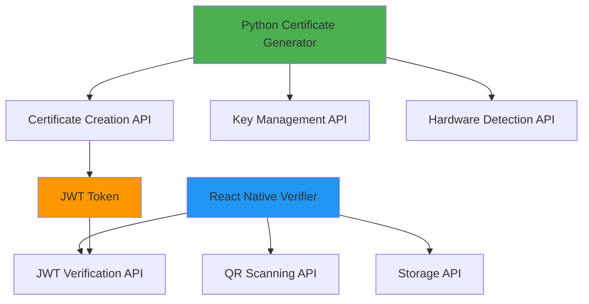

# 📚 API Reference - Certificate Verification System

**Version**: 1.0.0  
**Last Updated**: January 26, 2025  
**Team**: Oblivion - SIH 2025

---

## 📋 **Table of Contents**

1. [API Overview](#-api-overview)
2. [Python Certificate Generator API](#-python-certificate-generator-api)
3. [React Native Verifier API](#-react-native-verifier-api)
4. [Certificate Format Specification](#-certificate-format-specification)
5. [JWT Payload Structure](#-jwt-payload-structure)
6. [Error Codes and Messages](#-error-codes-and-messages)
7. [Integration Examples](#-integration-examples)
8. [SDK Documentation](#-sdk-documentation)
9. [Third-party Integrations](#-third-party-integrations)
10. [API Versioning](#-api-versioning)

---

## 🎯 **API Overview**

The Certificate Verification System provides two main API surfaces:

1. **Python Certificate Generator API**: For creating and managing certificates
2. **React Native Verifier API**: For scanning and verifying certificates

### **API Design Principles**

- **Security First**: All APIs prioritize security and data integrity
- **Offline Capability**: Core functionality works without network connectivity
- **Cross-Platform**: APIs work consistently across different platforms
- **Error Handling**: Comprehensive error reporting and handling
- **Documentation**: Well-documented with examples and use cases

### **API Architecture**



---

## 🐍 **Python Certificate Generator API**

### **Core Certificate Generation**

#### **`create_certificate(certificate_data: dict) -> dict`**

Creates a new certificate with the provided data.

**Parameters:**
```python
certificate_data: dict = {
    "holder_name": str,           # Required: Certificate holder name
    "certificate_type": str,      # Required: Type of certificate
    "issue_date": str,           # Optional: ISO format date (defaults to now)
    "expiry_date": str,          # Optional: ISO format date (defaults to 1 year)
    "issuer": str,               # Optional: Certificate issuer
    "additional_data": dict      # Optional: Additional certificate data
}
```

**Returns:**
```python
{
    "success": bool,
    "certificate_id": str,
    "jwt_token": str,
    "qr_code_data": str,
    "qr_code_image": PIL.Image,
    "file_paths": {
        "jwt_file": str,
        "qr_image_file": str,
        "metadata_file": str
    },
    "error": str | None
}
```

**Example Usage:**
```python
from certificate_generator import create_certificate

# Create certificate data
cert_data = {
    "holder_name": "John Doe",
    "certificate_type": "Achievement Certificate",
    "issuer": "Tech Institute",
    "additional_data": {
        "course": "Advanced Python Programming",
        "grade": "A+",
        "completion_date": "2025-01-26"
    }
}

# Generate certificate
result = create_certificate(cert_data)

if result["success"]:
    print(f"Certificate created: {result['certificate_id']}")
    print(f"JWT Token: {result['jwt_token']}")
    print(f"Files saved to: {result['file_paths']}")
else:
    print(f"Error: {result['error']}")
```

#### **`verify_certificate_local(jwt_token: str) -> dict`**

Verifies a certificate using the local private key (for testing purposes).

**Parameters:**
```python
jwt_token: str  # JWT token to verify
```

**Returns:**
```python
{
    "valid": bool,
    "payload": dict,
    "error": str | None,
    "verification_details": {
        "signature_valid": bool,
        "not_expired": bool,
        "issuer_valid": bool,
        "device_match": bool
    }
}
```

**Example Usage:**
```python
from certificate_generator import verify_certificate_local

# Verify certificate
verification = verify_certificate_local(jwt_token)

if verification["valid"]:
    print("Certificate is valid!")
    print(f"Holder: {verification['payload']['certificate_data']['holder_name']}")
else:
    print(f"Certificate invalid: {verification['error']}")
```

### **Key Management API**

#### **`generate_rsa_keypair(key_size: int = 2048) -> dict`**

Generates a new RSA key pair for certificate signing.

**Parameters:**
```python
key_size: int = 2048  # RSA key size (2048, 3072, or 4096)
```

**Returns:**
```python
{
    "success": bool,
    "private_key": str,      # PEM format private key
    "public_key": str,       # PEM format public key
    "key_size": int,
    "file_paths": {
        "private_key_file": str,
        "public_key_file": str
    },
    "error": str | None
}
```

**Example Usage:**
```python
from generate_keys import generate_rsa_keypair

# Generate new key pair
keys = generate_rsa_keypair(key_size=2048)

if keys["success"]:
    print("Keys generated successfully!")
    print(f"Private key saved: {keys['file_paths']['private_key_file']}")
    print(f"Public key saved: {keys['file_paths']['public_key_file']}")
else:
    print(f"Key generation failed: {keys['error']}")
```

#### **`load_private_key(file_path: str, password: str = None) -> dict`**

Loads a private key from file.

**Parameters:**
```python
file_path: str      # Path to private key file
password: str       # Optional password for encrypted keys
```

**Returns:**
```python
{
    "success": bool,
    "private_key": cryptography.hazmat.primitives.asymmetric.rsa.RSAPrivateKey,
    "key_size": int,
    "error": str | None
}
```

#### **`load_public_key(file_path: str) -> dict`**

Loads a public key from file.

**Parameters:**
```python
file_path: str      # Path to public key file
```

**Returns:**
```python
{
    "success": bool,
    "public_key": cryptography.hazmat.primitives.asymmetric.rsa.RSAPublicKey,
    "key_size": int,
    "error": str | None
}
```

### **Hardware Detection API**

#### **`get_device_info() -> dict`**

Retrieves comprehensive device information for hardware fingerprinting.

**Parameters:** None

**Returns:**
```python
{
    "device_type": str,          # "Desktop", "Laptop", "Server"
    "device_name": str,          # Computer name
    "operating_system": str,     # OS name and version
    "processor": str,            # CPU information
    "architecture": str,         # System architecture
    "motherboard_serial": str,   # Motherboard serial number
    "disk_serial": str,          # Primary disk serial
    "mac_address": str,          # Primary network adapter MAC
    "device_hash": str,          # SHA-256 hash of device info
    "timestamp": str,            # ISO format timestamp
    "error": str | None
}
```

**Example Usage:**
```python
from hardware_info import get_device_info

# Get device information
device_info = get_device_info()

print(f"Device Type: {device_info['device_type']}")
print(f"Device Name: {device_info['device_name']}")
print(f"Device Hash: {device_info['device_hash']}")
```

#### **`get_motherboard_serial() -> str`**

Retrieves the motherboard serial number.

**Returns:** `str` - Motherboard serial number or empty string if not available

#### **`get_disk_serial() -> str`**

Retrieves the primary disk serial number.

**Returns:** `str` - Disk serial number or empty string if not available

#### **`generate_device_hash(device_info: dict) -> str`**

Generates a SHA-256 hash of device information.

**Parameters:**
```python
device_info: dict  # Device information dictionary
```

**Returns:** `str` - SHA-256 hash of device information

### **GUI Application API**

#### **`CertificateGeneratorApp` Class**

Main GUI application class.

**Methods:**

##### **`__init__(self)`**
Initializes the GUI application.

##### **`create_gui(self) -> None`**
Creates and displays the GUI interface.

##### **`on_generate_certificate(self) -> None`**
Handles certificate generation button click.

##### **`on_save_certificate(self) -> None`**
Handles certificate saving functionality.

##### **`display_qr_code(self, qr_image: PIL.Image) -> None`**
Displays QR code in the GUI.

**Example Usage:**
```python
from certificate_generator import CertificateGeneratorApp

# Create and run the application
app = CertificateGeneratorApp()
app.create_gui()
app.mainloop()  # Start the GUI event loop
```

---

## 📱 **React Native Verifier API**

### **QR Code Scanning API**

#### **`ScannerScreen` Component**

Main QR code scanning component.

**Props:**
```typescript
interface ScannerScreenProps {
  navigation: NavigationProp<any>;
  onScanSuccess?: (data: string) => void;
  onScanError?: (error: string) => void;
}
```

**State:**
```typescript
interface ScannerState {
  hasPermission: boolean | null;
  scanned: boolean;
  scanning: boolean;
  error: string | null;
}
```

**Methods:**

##### **`requestCameraPermission() -> Promise<boolean>`**
Requests camera permission from the user.

**Returns:** `Promise<boolean>` - True if permission granted

##### **`handleBarCodeScanned(scanResult: BarCodeScanningResult) -> void`**
Handles QR code scan results.

**Parameters:**
```typescript
scanResult: {
  type: string;    // Barcode type (e.g., "qr")
  data: string;    // Scanned data (JWT token)
}
```

##### **`resetScanner() -> void`**
Resets the scanner state for new scans.

**Example Usage:**
```jsx
import React from 'react';
import ScannerScreen from './components/ScannerScreen';

export default function App() {
  const handleScanSuccess = (data) => {
    console.log('Scanned data:', data);
    // Process JWT token
  };

  const handleScanError = (error) => {
    console.error('Scan error:', error);
  };

  return (
    <ScannerScreen
      onScanSuccess={handleScanSuccess}
      onScanError={handleScanError}
    />
  );
}
```

### **JWT Verification API**

#### **`verifyJWT(token: string) -> Promise<VerificationResult>`**

Verifies a JWT certificate token.

**Parameters:**
```typescript
token: string  // JWT token to verify
```

**Returns:**
```typescript
interface VerificationResult {
  valid: boolean;
  certificate: CertificateData | null;
  error: string | null;
  verificationDetails: {
    signatureValid: boolean;
    notExpired: boolean;
    issuerValid: boolean;
    formatValid: boolean;
  };
}

interface CertificateData {
  certificate_id: string;
  holder_name: string;
  certificate_type: string;
  issue_date: string;
  expiry_date: string;
  issuer: string;
  device_info: DeviceInfo;
  additional_data: any;
}
```

**Example Usage:**
```javascript
import { verifyJWT } from '../utils/jwtVerifier';

const handleCertificateVerification = async (jwtToken) => {
  try {
    const result = await verifyJWT(jwtToken);
    
    if (result.valid) {
      console.log('Certificate is valid!');
      console.log('Holder:', result.certificate.holder_name);
      console.log('Type:', result.certificate.certificate_type);
    } else {
      console.log('Certificate is invalid:', result.error);
    }
  } catch (error) {
    console.error('Verification error:', error);
  }
};
```

#### **`extractJWTPayload(token: string) -> object | null`**

Extracts payload from JWT token without verification.

**Parameters:**
```typescript
token: string  // JWT token
```

**Returns:** `object | null` - JWT payload or null if invalid

#### **`validateJWTFormat(token: string) -> boolean`**

Validates JWT token format.

**Parameters:**
```typescript
token: string  // JWT token to validate
```

**Returns:** `boolean` - True if format is valid

### **Certificate Display API**

#### **`CertificateScreen` Component**

Component for displaying verified certificates.

**Props:**
```typescript
interface CertificateScreenProps {
  route: {
    params: {
      certificate: CertificateData;
      verificationResult: VerificationResult;
    };
  };
  navigation: NavigationProp<any>;
}
```

**Methods:**

##### **`shareCertificate() -> Promise<void>`**
Shares certificate information using native share API.

##### **`saveCertificate() -> Promise<void>`**
Saves certificate to local storage.

##### **`formatCertificateData(certificate: CertificateData) -> FormattedData`**
Formats certificate data for display.

**Example Usage:**
```jsx
import React from 'react';
import CertificateScreen from './components/CertificateScreen';

// Navigation setup
const Stack = createNativeStackNavigator();

function AppNavigator() {
  return (
    <Stack.Navigator>
      <Stack.Screen 
        name="Certificate" 
        component={CertificateScreen}
        options={{ title: 'Certificate Details' }}
      />
    </Stack.Navigator>
  );
}
```

### **Storage API**

#### **`saveCertificate(certificate: CertificateData) -> Promise<boolean>`**

Saves certificate to local storage.

**Parameters:**
```typescript
certificate: CertificateData  // Certificate data to save
```

**Returns:** `Promise<boolean>` - True if saved successfully

#### **`loadCertificates() -> Promise<CertificateData[]>`**

Loads all saved certificates from local storage.

**Returns:** `Promise<CertificateData[]>` - Array of saved certificates

#### **`deleteCertificate(certificateId: string) -> Promise<boolean>`**

Deletes a certificate from local storage.

**Parameters:**
```typescript
certificateId: string  // ID of certificate to delete
```

**Returns:** `Promise<boolean>` - True if deleted successfully

#### **`clearAllCertificates() -> Promise<boolean>`**

Clears all certificates from local storage.

**Returns:** `Promise<boolean>` - True if cleared successfully

**Example Usage:**
```javascript
import { 
  saveCertificate, 
  loadCertificates, 
  deleteCertificate 
} from '../utils/storage';

// Save certificate
const saveResult = await saveCertificate(certificateData);
if (saveResult) {
  console.log('Certificate saved successfully');
}

// Load all certificates
const certificates = await loadCertificates();
console.log(`Loaded ${certificates.length} certificates`);

// Delete specific certificate
const deleteResult = await deleteCertificate('cert-123');
if (deleteResult) {
  console.log('Certificate deleted');
}
```

---

## 📄 **Certificate Format Specification**

### **JWT Structure**

The certificate uses JSON Web Token (JWT) format with the following structure:

```
Header.Payload.Signature
```

#### **JWT Header**
```json
{
  "alg": "RS256",
  "typ": "JWT"
}
```

#### **JWT Payload**
```json
{
  "iss": "Certificate Authority",
  "sub": "certificate_id",
  "iat": 1706274622,
  "exp": 1737810622,
  "certificate_id": "cert_20250126_143022",
  "certificate_data": {
    "holder_name": "John Doe",
    "certificate_type": "Achievement Certificate",
    "issue_date": "2025-01-26T14:30:22Z",
    "expiry_date": "2026-01-26T14:30:22Z",
    "issuer": "Tech Institute",
    "additional_data": {
      "course": "Advanced Python Programming",
      "grade": "A+",
      "completion_date": "2025-01-26"
    }
  },
  "device_info": {
    "device_type": "Desktop",
    "device_hash": "sha256_hash_of_device_info",
    "generation_timestamp": "2025-01-26T14:30:22Z"
  },
  "security": {
    "version": "1.0",
    "algorithm": "RS256",
    "key_id": "key_fingerprint"
  }
}
```

#### **JWT Signature**
RSA-SHA256 signature of the header and payload using the private key.

### **QR Code Format**

The QR code contains the complete JWT token as a string:

```
eyJhbGciOiJSUzI1NiIsInR5cCI6IkpXVCJ9.eyJpc3MiOiJDZXJ0aWZpY2F0ZSBBdXRob3JpdHkiLCJzdWIiOiJjZXJ0XzIwMjUwMTI2XzE0MzAyMiIsImlhdCI6MTcwNjI3NDYyMiwiZXhwIjoxNzM3ODEwNjIyLCJjZXJ0aWZpY2F0ZV9pZCI6ImNlcnRfMjAyNTAxMjZfMTQzMDIyIiwiY2VydGlmaWNhdGVfZGF0YSI6eyJob2xkZXJfbmFtZSI6IkpvaG4gRG9lIiwiY2VydGlmaWNhdGVfdHlwZSI6IkFjaGlldmVtZW50IENlcnRpZmljYXRlIiwiaXNzdWVfZGF0ZSI6IjIwMjUtMDEtMjZUMTQ6MzA6MjJaIiwiZXhwaXJ5X2RhdGUiOiIyMDI2LTAxLTI2VDE0OjMwOjIyWiIsImlzc3VlciI6IlRlY2ggSW5zdGl0dXRlIiwiYWRkaXRpb25hbF9kYXRhIjp7ImNvdXJzZSI6IkFkdmFuY2VkIFB5dGhvbiBQcm9ncmFtbWluZyIsImdyYWRlIjoiQSsiLCJjb21wbGV0aW9uX2RhdGUiOiIyMDI1LTAxLTI2In19LCJkZXZpY2VfaW5mbyI6eyJkZXZpY2VfdHlwZSI6IkRlc2t0b3AiLCJkZXZpY2VfaGFzaCI6InNoYTI1Nl9oYXNoX29mX2RldmljZV9pbmZvIiwiZ2VuZXJhdGlvbl90aW1lc3RhbXAiOiIyMDI1LTAxLTI2VDE0OjMwOjIyWiJ9LCJzZWN1cml0eSI6eyJ2ZXJzaW9uIjoiMS4wIiwiYWxnb3JpdGhtIjoiUlMyNTYiLCJrZXlfaWQiOiJrZXlfZmluZ2VycHJpbnQifX0.signature_here
```

**QR Code Properties:**
- **Error Correction Level**: L (Low) - ~7% error correction
- **Version**: Auto-selected based on data size
- **Module Size**: 10 pixels per module
- **Border**: 4 modules
- **Colors**: Black on white background

---

## 🔧 **JWT Payload Structure**

### **Standard JWT Claims**

| Claim | Type | Description | Required |
|-------|------|-------------|----------|
| `iss` | string | Issuer of the certificate | Yes |
| `sub` | string | Subject (certificate ID) | Yes |
| `iat` | number | Issued at timestamp | Yes |
| `exp` | number | Expiration timestamp | Yes |
| `jti` | string | JWT ID (unique identifier) | Optional |

### **Custom Certificate Claims**

#### **`certificate_id`** (string)
Unique identifier for the certificate in format: `cert_YYYYMMDD_HHMMSS`

#### **`certificate_data`** (object)
Core certificate information:

```typescript
interface CertificateData {
  holder_name: string;           // Certificate holder's name
  certificate_type: string;      // Type of certificate
  issue_date: string;           // ISO 8601 date string
  expiry_date: string;          // ISO 8601 date string
  issuer: string;               // Certificate issuing authority
  additional_data: object;      // Custom certificate data
}
```

#### **`device_info`** (object)
Device fingerprinting information:

```typescript
interface DeviceInfo {
  device_type: string;          // "Desktop", "Laptop", "Server"
  device_hash: string;          // SHA-256 hash of device info
  generation_timestamp: string; // ISO 8601 timestamp
}
```

#### **`security`** (object)
Security metadata:

```typescript
interface SecurityInfo {
  version: string;              // Certificate format version
  algorithm: string;            // Signing algorithm (RS256)
  key_id: string;              // Key fingerprint/identifier
}
```

### **Payload Validation Rules**

1. **Required Fields**: All required fields must be present
2. **Data Types**: All fields must match specified types
3. **Date Format**: All dates must be valid ISO 8601 strings
4. **String Length**: String fields have maximum length limits
5. **Expiration**: Certificate must not be expired
6. **Signature**: JWT signature must be valid

---

## ❌ **Error Codes and Messages**

### **Python Certificate Generator Errors**

#### **Certificate Generation Errors**

| Error Code | Error Message | Description | Resolution |
|------------|---------------|-------------|------------|
| `CERT_001` | "Missing required field: {field_name}" | Required certificate data missing | Provide all required fields |
| `CERT_002` | "Invalid date format: {date_value}" | Date not in ISO 8601 format | Use valid ISO 8601 date format |
| `CERT_003` | "Certificate data too large" | Certificate data exceeds size limits | Reduce certificate data size |
| `CERT_004` | "Invalid certificate type" | Unsupported certificate type | Use supported certificate types |
| `CERT_005` | "Expiry date before issue date" | Invalid date range | Ensure expiry date is after issue date |

#### **Key Management Errors**

| Error Code | Error Message | Description | Resolution |
|------------|---------------|-------------|------------|
| `KEY_001` | "Private key file not found" | Private key file missing | Generate or provide private key file |
| `KEY_002` | "Invalid private key format" | Private key format incorrect | Use valid PEM format private key |
| `KEY_003` | "Key generation failed" | RSA key generation error | Check system resources and retry |
| `KEY_004` | "Insufficient key size" | Key size below minimum | Use minimum 2048-bit keys |
| `KEY_005` | "Key file permission denied" | Cannot access key file | Check file permissions |

#### **Hardware Detection Errors**

| Error Code | Error Message | Description | Resolution |
|------------|---------------|-------------|------------|
| `HW_001` | "Cannot detect motherboard serial" | Motherboard serial unavailable | Run with administrator privileges |
| `HW_002` | "Cannot detect disk serial" | Disk serial unavailable | Check disk access permissions |
| `HW_003` | "Hardware detection timeout" | Hardware detection took too long | Retry or check system health |
| `HW_004` | "Unsupported operating system" | OS not supported for hardware detection | Use supported operating system |

### **React Native Verifier Errors**

#### **QR Scanning Errors**

| Error Code | Error Message | Description | Resolution |
|------------|---------------|-------------|------------|
| `SCAN_001` | "Camera permission denied" | User denied camera access | Grant camera permission in settings |
| `SCAN_002` | "Camera not available" | Device camera not accessible | Check camera hardware and permissions |
| `SCAN_003` | "Invalid QR code format" | QR code doesn't contain valid data | Scan a valid certificate QR code |
| `SCAN_004` | "QR code too damaged to read" | QR code is corrupted or damaged | Use a clear, undamaged QR code |
| `SCAN_005` | "Scanning timeout" | QR code scanning timed out | Retry scanning with better lighting |

#### **JWT Verification Errors**

| Error Code | Error Message | Description | Resolution |
|------------|---------------|-------------|------------|
| `JWT_001` | "Invalid JWT format" | JWT token format is incorrect | Use a valid JWT token |
| `JWT_002` | "JWT signature verification failed" | Digital signature is invalid | Certificate may be tampered with |
| `JWT_003` | "JWT token expired" | Certificate has expired | Use a valid, non-expired certificate |
| `JWT_004` | "Invalid issuer" | JWT issuer is not recognized | Use certificate from valid issuer |
| `JWT_005` | "Missing required claims" | JWT missing required fields | Use complete certificate data |
| `JWT_006` | "Public key not found" | Public key for verification missing | Ensure public key is embedded in app |

#### **Storage Errors**

| Error Code | Error Message | Description | Resolution |
|------------|---------------|-------------|------------|
| `STORE_001` | "Storage permission denied" | Cannot access device storage | Grant storage permission |
| `STORE_002` | "Insufficient storage space" | Not enough space to save certificate | Free up device storage |
| `STORE_003` | "Certificate not found" | Requested certificate doesn't exist | Check certificate ID |
| `STORE_004` | "Storage corruption detected" | Local storage is corrupted | Clear app data and restart |

### **Error Handling Best Practices**

#### **Python Error Handling**
```python
try:
    result = create_certificate(cert_data)
    if not result["success"]:
        # Handle specific error
        error_code = result.get("error_code", "UNKNOWN")
        error_message = result.get("error", "Unknown error")
        
        if error_code == "CERT_001":
            # Handle missing field error
            missing_field = result.get("missing_field")
            print(f"Please provide: {missing_field}")
        elif error_code == "KEY_001":
            # Handle missing key error
            print("Generating new key pair...")
            generate_rsa_keypair()
        else:
            print(f"Error {error_code}: {error_message}")
            
except Exception as e:
    print(f"Unexpected error: {str(e)}")
```

#### **React Native Error Handling**
```javascript
const handleCertificateVerification = async (jwtToken) => {
  try {
    const result = await verifyJWT(jwtToken);
    
    if (!result.valid) {
      const errorCode = result.errorCode || 'UNKNOWN';
      const errorMessage = result.error || 'Unknown error';
      
      switch (errorCode) {
        case 'JWT_001':
          Alert.alert('Invalid Certificate', 'The QR code does not contain a valid certificate.');
          break;
        case 'JWT_002':
          Alert.alert('Security Warning', 'Certificate signature is invalid. This certificate may have been tampered with.');
          break;
        case 'JWT_003':
          Alert.alert('Expired Certificate', 'This certificate has expired.');
          break;
        default:
          Alert.alert('Verification Error', errorMessage);
      }
    } else {
      // Handle successful verification
      navigation.navigate('Certificate', { certificate: result.certificate });
    }
  } catch (error) {
    console.error('Verification error:', error);
    Alert.alert('Error', 'An unexpected error occurred during verification.');
  }
};
```

---

## 💡 **Integration Examples**

### **Python Integration Example**

#### **Basic Certificate Generation**
```python
#!/usr/bin/env python3
"""
Example: Basic certificate generation integration
"""

from certificate_generator import create_certificate, generate_rsa_keypair
import json

def main():
    # Step 1: Generate keys (one-time setup)
    print("Generating RSA key pair...")
    keys = generate_rsa_keypair(key_size=2048)
    
    if not keys["success"]:
        print(f"Key generation failed: {keys['error']}")
        return
    
    print("Keys generated successfully!")
    
    # Step 2: Create certificate data
    certificate_data = {
        "holder_name": "Alice Johnson",
        "certificate_type": "Course Completion Certificate",
        "issuer": "Online Learning Platform",
        "additional_data": {
            "course_name": "Data Science Fundamentals",
            "completion_date": "2025-01-26",
            "score": "95%",
            "instructor": "Dr. Smith",
            "course_duration": "40 hours"
        }
    }
    
    # Step 3: Generate certificate
    print("Creating certificate...")
    result = create_certificate(certificate_data)
    
    if result["success"]:
        print(f"Certificate created successfully!")
        print(f"Certificate ID: {result['certificate_id']}")
        print(f"JWT Token: {result['jwt_token'][:50]}...")
        print(f"Files saved:")
        for file_type, file_path in result['file_paths'].items():
            print(f"  {file_type}: {file_path}")
    else:
        print(f"Certificate creation failed: {result['error']}")

if __name__ == "__main__":
    main()
```

#### **Batch Certificate Generation**
```python
#!/usr/bin/env python3
"""
Example: Batch certificate generation for multiple recipients
"""

from certificate_generator import create_certificate
import csv
import json

def generate_batch_certificates(csv_file_path):
    """Generate certificates for multiple recipients from CSV file."""
    
    certificates = []
    
    with open(csv_file_path, 'r', newline='', encoding='utf-8') as csvfile:
        reader = csv.DictReader(csvfile)
        
        for row in reader:
            # Create certificate data from CSV row
            cert_data = {
                "holder_name": row['name'],
                "certificate_type": row['certificate_type'],
                "issuer": row['issuer'],
                "additional_data": {
                    "course": row.get('course', ''),
                    "grade": row.get('grade', ''),
                    "completion_date": row.get('completion_date', ''),
                    "student_id": row.get('student_id', '')
                }
            }
            
            # Generate certificate
            result = create_certificate(cert_data)
            
            if result["success"]:
                certificates.append({
                    "name": row['name'],
                    "certificate_id": result['certificate_id'],
                    "jwt_token": result['jwt_token'],
                    "files": result['file_paths']
                })
                print(f"✓ Certificate generated for {row['name']}")
            else:
                print(f"✗ Failed to generate certificate for {row['name']}: {result['error']}")
    
    # Save batch results
    with open('batch_results.json', 'w') as f:
        json.dump(certificates, f, indent=2)
    
    print(f"\nBatch generation complete. {len(certificates)} certificates generated.")
    return certificates

# Example CSV format:
# name,certificate_type,issuer,course,grade,completion_date,student_id
# John Doe,Course Certificate,Tech University,Python Programming,A+,2025-01-26,STU001
# Jane Smith,Achievement Certificate,Tech University,Web Development,A,2025-01-25,STU002

if __name__ == "__main__":
    certificates = generate_batch_certificates('students.csv')
```

### **React Native Integration Example**

#### **Complete Certificate Verification Flow**
```javascript
// App.js - Main application with navigation
import React from 'react';
import { NavigationContainer } from '@react-navigation/native';
import { createNativeStackNavigator } from '@react-navigation/native-stack';
import ScannerScreen from './src/components/ScannerScreen';
import CertificateScreen from './src/components/CertificateScreen';
import HomeScreen from './src/components/HomeScreen';

const Stack = createNativeStackNavigator();

export default function App() {
  return (
    <NavigationContainer>
      <Stack.Navigator initialRouteName="Home">
        <Stack.Screen 
          name="Home" 
          component={HomeScreen}
          options={{ title: 'Certificate Verifier' }}
        />
        <Stack.Screen 
          name="Scanner" 
          component={ScannerScreen}
          options={{ title: 'Scan Certificate' }}
        />
        <Stack.Screen 
          name="Certificate" 
          component={CertificateScreen}
          options={{ title: 'Certificate Details' }}
        />
      </Stack.Navigator>
    </NavigationContainer>
  );
}
```

```javascript
// src/components/ScannerScreen.js - QR code scanning implementation
import React, { useState, useEffect } from 'react';
import { View, Text, StyleSheet, Alert, TouchableOpacity } from 'react-native';
import { Camera } from 'expo-camera';
import { verifyJWT } from '../utils/jwtVerifier';

export default function ScannerScreen({ navigation }) {
  const [hasPermission, setHasPermission] = useState(null);
  const [scanned, setScanned] = useState(false);
  const [scanning, setScanning] = useState(true);

  useEffect(() => {
    requestCameraPermission();
  }, []);

  const requestCameraPermission = async () => {
    const { status } = await Camera.requestCameraPermissionsAsync();
    setHasPermission(status === 'granted');
  };

  const handleBarCodeScanned = async ({ type, data }) => {
    if (scanned) return;
    
    setScanned(true);
    setScanning(false);

    try {
      // Verify the JWT certificate
      const verificationResult = await verifyJWT(data);
      
      if (verificationResult.valid) {
        // Navigate to certificate display
        navigation.navigate('Certificate', {
          certificate: verificationResult.certificate,
          verificationResult: verificationResult
        });
      } else {
        // Show error alert
        Alert.alert(
          'Invalid Certificate',
          verificationResult.error || 'Certificate verification failed',
          [
            {
              text: 'Scan Again',
              onPress: () => {
                setScanned(false);
                setScanning(true);
              }
            }
          ]
        );
      }
    } catch (error) {
      console.error('Verification error:', error);
      Alert.alert(
        'Verification Error',
        'An error occurred while verifying the certificate',
        [
          {
            text: 'Scan Again',
            onPress: () => {
              setScanned(false);
              setScanning(true);
            }
          }
        ]
      );
    }
  };

  if (hasPermission === null) {
    return (
      <View style={styles.container}>
        <Text>Requesting camera permission...</Text>
      </View>
    );
  }

  if (hasPermission === false) {
    return (
      <View style={styles.container}>
        <Text style={styles.text}>No access to camera</Text>
        <TouchableOpacity 
          style={styles.button}
          onPress={requestCameraPermission}
        >
          <Text style={styles.buttonText}>Grant Permission</Text>
        </TouchableOpacity>
      </View>
    );
  }

  return (
    <View style={styles.container}>
      <Camera
        style={styles.camera}
        onBarCodeScanned={scanning ? handleBarCodeScanned : undefined}
        barCodeScannerSettings={{
          barCodeTypes: ['qr'],
        }}
      >
        <View style={styles.overlay}>
          <View style={styles.scanArea} />
          <Text style={styles.instructions}>
            Position the QR code within the frame
          </Text>
          {scanned && (
            <TouchableOpacity
              style={styles.scanAgainButton}
              onPress={() => {
                setScanned(false);
                setScanning(true);
              }}
            >
              <Text style={styles.scanAgainText}>Scan Again</Text>
            </TouchableOpacity>
          )}
        </View>
      </Camera>
    </View>
  );
}

const styles = StyleSheet.create({
  container: {
    flex: 1,
    justifyContent: 'center',
    alignItems: 'center',
  },
  camera: {
    flex: 1,
    width: '100%',
  },
  overlay: {
    flex: 1,
    backgroundColor: 'rgba(0,0,0,0.5)',
    justifyContent: 'center',
    alignItems: 'center',
  },
  scanArea: {
    width: 250,
    height: 250,
    borderWidth: 2,
    borderColor: '#00ff00',
    backgroundColor: 'transparent',
  },
  instructions: {
    color: 'white',
    fontSize: 16,
    textAlign: 'center',
    marginTop: 20,
    paddingHorizontal: 20,
  },
  scanAgainButton: {
    backgroundColor: '#007AFF',
    paddingHorizontal: 20,
    paddingVertical: 10,
    borderRadius: 5,
    marginTop: 20,
  },
  scanAgainText: {
    color: 'white',
    fontSize: 16,
    fontWeight: 'bold',
  },
  text: {
    fontSize: 18,
    marginBottom: 20,
  },
  button: {
    backgroundColor: '#007AFF',
    paddingHorizontal: 20,
    paddingVertical: 10,
    borderRadius: 5,
  },
  buttonText: {
    color: 'white',
    fontSize: 16,
    fontWeight: 'bold',
  },
});
```

#### **Custom Hook for Certificate Management**
```javascript
// src/hooks/useCertificates.js - Custom hook for certificate management
import { useState, useEffect } from 'react';
import { 
  saveCertificate, 
  loadCertificates, 
  deleteCertificate 
} from '../utils/storage';

export function useCertificates() {
  const [certificates, setCertificates] = useState([]);
  const [loading, setLoading] = useState(true);
  const [error, setError] = useState(null);

  useEffect(() => {
    loadSavedCertificates();
  }, []);

  const loadSavedCertificates = async () => {
    try {
      setLoading(true);
      const savedCertificates = await loadCertificates();
      setCertificates(savedCertificates);
      setError(null);
    } catch (err) {
      setError(err.message);
      console.error('Error loading certificates:', err);
    } finally {
      setLoading(false);
    }
  };

  const addCertificate = async (certificate) => {
    try {
      const success = await saveCertificate(certificate);
      if (success) {
        setCertificates(prev => [...prev, certificate]);
        return true;
      }
      return false;
    } catch (err) {
      setError(err.message);
      console.error('Error saving certificate:', err);
      return false;
    }
  };

  const removeCertificate = async (certificateId) => {
    try {
      const success = await deleteCertificate(certificateId);
      if (success) {
        setCertificates(prev => 
          prev.filter(cert => cert.certificate_id !== certificateId)
        );
        return true;
      }
      return false;
    } catch (err) {
      setError(err.message);
      console.error('Error deleting certificate:', err);
      return false;
    }
  };

  const refreshCertificates = () => {
    loadSavedCertificates();
  };

  return {
    certificates,
    loading,
    error,
    addCertificate,
    removeCertificate,
    refreshCertificates
  };
}

// Usage example:
// const { certificates, loading, addCertificate } = useCertificates();
```

---

## 📦 **SDK Documentation**

### **Python SDK**

#### **Installation**
```bash
pip install certificate-generator-sdk
```

#### **Quick Start**
```python
from certificate_generator_sdk import CertificateGenerator

# Initialize the generator
generator = CertificateGenerator()

# Generate a certificate
certificate = generator.create({
    "holder_name": "John Doe",
    "certificate_type": "Achievement Certificate",
    "issuer": "My Organization"
})

print(f"Certificate ID: {certificate.id}")
print(f"JWT Token: {certificate.jwt_token}")
```

#### **Advanced Usage**
```python
from certificate_generator_sdk import CertificateGenerator, KeyManager

# Custom key management
key_manager = KeyManager()
keys = key_manager.generate_keypair(key_size=4096)

# Initialize generator with custom keys
generator = CertificateGenerator(
    private_key=keys.private_key,
    public_key=keys.public_key
)

# Create certificate with custom settings
certificate = generator.create({
    "holder_name": "Jane Smith",
    "certificate_type": "Professional Certificate",
    "issuer": "Professional Body",
    "validity_period": "2 years",
    "custom_fields": {
        "license_number": "LIC-2025-001",
        "specialization": "Data Science"
    }
})

# Save certificate with custom format
certificate.save(
    format="both",  # JWT and QR code
    directory="./certificates",
    filename_template="{holder_name}_{certificate_type}_{date}"
)
```

### **React Native SDK**

#### **Installation**
```bash
npm install react-native-certificate-verifier
```

#### **Setup**
```javascript
// App.js
import { CertificateProvider } from 'react-native-certificate-verifier';

export default function App() {
  return (
    <CertificateProvider
      publicKey={PUBLIC_KEY}
      options={{
        autoSave: true,
        validateExpiry: true,
        allowOfflineVerification: true
      }}
    >
      <YourAppComponents />
    </CertificateProvider>
  );
}
```

#### **Usage**
```javascript
import { useCertificateVerifier } from 'react-native-certificate-verifier';

function ScannerComponent() {
  const { verifyJWT, isLoading, error } = useCertificateVerifier();

  const handleScan = async (jwtToken) => {
    const result = await verifyJWT(jwtToken);
    
    if (result.valid) {
      console.log('Certificate verified:', result.certificate);
    } else {
      console.log('Verification failed:', result.error);
    }
  };

  return (
    // Your scanner component
  );
}
```

---

## 🔗 **Third-party Integrations**

### **Database Integration**

#### **SQLite Integration (Python)**
```python
import sqlite3
from certificate_generator import create_certificate

class CertificateDatabase:
    def __init__(self, db_path="certificates.db"):
        self.db_path = db_path
        self.init_database()
    
    def init_database(self):
        conn = sqlite3.connect(self.db_path)
        cursor = conn.cursor()
        
        cursor.execute('''
            CREATE TABLE IF NOT EXISTS certificates (
                id TEXT PRIMARY KEY,
                holder_name TEXT NOT NULL,
                certificate_type TEXT NOT NULL,
                jwt_token TEXT NOT NULL,
                created_at TIMESTAMP DEFAULT CURRENT_TIMESTAMP,
                expires_at TIMESTAMP,
                issuer TEXT,
                additional_data TEXT
            )
        ''')
        
        conn.commit()
        conn.close()
    
    def save_certificate(self, certificate_data, jwt_token):
        conn = sqlite3.connect(self.db_path)
        cursor = conn.cursor()
        
        cursor.execute('''
            INSERT INTO certificates 
            (id, holder_name, certificate_type, jwt_token, expires_at, issuer, additional_data)
            VALUES (?, ?, ?, ?, ?, ?, ?)
        ''', (
            certificate_data['certificate_id'],
            certificate_data['holder_name'],
            certificate_data['certificate_type'],
            jwt_token,
            certificate_data.get('expiry_date'),
            certificate_data.get('issuer'),
            str(certificate_data.get('additional_data', {}))
        ))
        
        conn.commit()
        conn.close()
    
    def get_certificate(self, certificate_id):
        conn = sqlite3.connect(self.db_path)
        cursor = conn.cursor()
        
        cursor.execute('SELECT * FROM certificates WHERE id = ?', (certificate_id,))
        result = cursor.fetchone()
        
        conn.close()
        return result

# Usage
db = CertificateDatabase()
certificate = create_certificate(cert_data)
db.save_certificate(certificate['certificate_data'], certificate['jwt_token'])
```

#### **Firebase Integration (React Native)**
```javascript
// firebase.js
import { initializeApp } from 'firebase/app';
import { getFirestore } from 'firebase/firestore';

const firebaseConfig = {
  // Your Firebase config
};

const app = initializeApp(firebaseConfig);
export const db = getFirestore(app);

// certificateService.js
import { collection, addDoc, getDocs, query, where } from 'firebase/firestore';
import { db } from './firebase';

export class CertificateService {
  static async saveCertificate(certificate) {
    try {
      const docRef = await addDoc(collection(db, 'certificates'), {
        ...certificate,
        createdAt: new Date(),
        verified: true
      });
      return docRef.id;
    } catch (error) {
      console.error('Error saving certificate:', error);
      throw error;
    }
  }

  static async getCertificatesByHolder(holderName) {
    try {
      const q = query(
        collection(db, 'certificates'),
        where('holder_name', '==', holderName)
      );
      const querySnapshot = await getDocs(q);
      
      return querySnapshot.docs.map(doc => ({
        id: doc.id,
        ...doc.data()
      }));
    } catch (error) {
      console.error('Error fetching certificates:', error);
      throw error;
    }
  }
}
```

### **Email Integration**

#### **SMTP Email Integration (Python)**
```python
import smtplib
from email.mime.multipart import MIMEMultipart
from email.mime.text import MIMEText
from email.mime.image import MIMEImage
from certificate_generator import create_certificate

class CertificateEmailer:
    def __init__(self, smtp_server, smtp_port, username, password):
        self.smtp_server = smtp_server
        self.smtp_port = smtp_port
        self.username = username
        self.password = password
    
    def send_certificate(self, recipient_email, certificate_data):
        # Generate certificate
        result = create_certificate(certificate_data)
        
        if not result["success"]:
            raise Exception(f"Certificate generation failed: {result['error']}")
        
        # Create email
        msg = MIMEMultipart()
        msg['From'] = self.username
        msg['To'] = recipient_email
        msg['Subject'] = f"Your {certificate_data['certificate_type']}"
        
        # Email body
        body = f"""
        Dear {certificate_data['holder_name']},
        
        Congratulations! Your certificate has been generated successfully.
        
        Certificate Details:
        - Type: {certificate_data['certificate_type']}
        - Issued by: {certificate_data.get('issuer', 'Certificate Authority')}
        - Certificate ID: {result['certificate_id']}
        
        Please find your certificate QR code attached to this email.
        You can verify this certificate using our mobile app.
        
        Best regards,
        Certificate Authority
        """
        
        msg.attach(MIMEText(body, 'plain'))
        
        # Attach QR code image
        with open(result['file_paths']['qr_image_file'], 'rb') as f:
            img_data = f.read()
            image = MIMEImage(img_data)
            image.add_header('Content-Disposition', 
                           f'attachment; filename=certificate_{result["certificate_id"]}.png')
            msg.attach(image)
        
        # Send email
        server = smtplib.SMTP(self.smtp_server, self.smtp_port)
        server.starttls()
        server.login(self.username, self.password)
        server.send_message(msg)
        server.quit()
        
        return result['certificate_id']

# Usage
emailer = CertificateEmailer(
    smtp_server="smtp.gmail.com",
    smtp_port=587,
    username="your-email@gmail.com",
    password="your-app-password"
)

certificate_id = emailer.send_certificate(
    recipient_email="recipient@example.com",
    certificate_data={
        "holder_name": "John Doe",
        "certificate_type": "Course Completion Certificate",
        "issuer": "Online Learning Platform"
    }
)
```

### **REST API Integration**

#### **Flask API Server (Python)**
```python
from flask import Flask, request, jsonify, send_file
from flask_cors import CORS
from certificate_generator import create_certificate, verify_certificate_local
import os

app = Flask(__name__)
CORS(app)

@app.route('/api/certificates', methods=['POST'])
def create_certificate_api():
    try:
        certificate_data = request.json
        
        # Validate required fields
        required_fields = ['holder_name', 'certificate_type']
        for field in required_fields:
            if field not in certificate_data:
                return jsonify({
                    'error': f'Missing required field: {field}',
                    'error_code': 'CERT_001'
                }), 400
        
        # Generate certificate
        result = create_certificate(certificate_data)
        
        if result['success']:
            return jsonify({
                'success': True,
                'certificate_id': result['certificate_id'],
                'jwt_token': result['jwt_token'],
                'qr_code_url': f"/api/certificates/{result['certificate_id']}/qr"
            })
        else:
            return jsonify({
                'success': False,
                'error': result['error']
            }), 500
            
    except Exception as e:
        return jsonify({
            'success': False,
            'error': str(e)
        }), 500

@app.route('/api/certificates/<certificate_id>/qr', methods=['GET'])
def get_qr_code(certificate_id):
    try:
        qr_file_path = f"output/certificates/{certificate_id}.png"
        
        if os.path.exists(qr_file_path):
            return send_file(qr_file_path, mimetype='image/png')
        else:
            return jsonify({'error': 'QR code not found'}), 404
            
    except Exception as e:
        return jsonify({'error': str(e)}), 500

@app.route('/api/certificates/verify', methods=['POST'])
def verify_certificate_api():
    try:
        data = request.json
        jwt_token = data.get('jwt_token')
        
        if not jwt_token:
            return jsonify({
                'error': 'JWT token is required',
                'error_code': 'JWT_001'
            }), 400
        
        # Verify certificate
        result = verify_certificate_local(jwt_token)
        
        return jsonify(result)
        
    except Exception as e:
        return jsonify({
            'valid': False,
            'error': str(e)
        }), 500

if __name__ == '__main__':
    app.run(debug=True, host='0.0.0.0', port=5000)
```

---

## 🔄 **API Versioning**

### **Versioning Strategy**

The Certificate Verification System uses **Semantic Versioning (SemVer)** for API versioning:

- **MAJOR.MINOR.PATCH** (e.g., 1.2.3)
- **MAJOR**: Breaking changes
- **MINOR**: New features (backward compatible)
- **PATCH**: Bug fixes (backward compatible)

### **Current API Versions**

| Component | Current Version | Supported Versions | Deprecation Date |
|-----------|----------------|-------------------|------------------|
| **Python Certificate Generator** | 1.0.0 | 1.0.x | N/A |
| **React Native Verifier** | 1.0.0 | 1.0.x | N/A |
| **JWT Certificate Format** | 1.0 | 1.0 | N/A |
| **QR Code Format** | 1.0 | 1.0 | N/A |

### **Version Compatibility Matrix**

| Generator Version | Verifier Version | Compatible | Notes |
|------------------|------------------|------------|-------|
| 1.0.x | 1.0.x | ✅ | Full compatibility |
| 1.1.x | 1.0.x | ✅ | Backward compatible |
| 2.0.x | 1.x.x | ❌ | Breaking changes |

### **Migration Guide**

#### **Upgrading from 1.0.x to 1.1.x**
- No breaking changes
- New optional features available
- Existing certificates remain valid

#### **Future 2.0.x Upgrade**
- Will include breaking changes
- Migration tools will be provided
- 6-month deprecation notice

---

**🎯 This comprehensive API reference provides complete documentation for integrating with and extending the Certificate Verification System, ensuring developers have all the information needed for successful implementation.**

---

**Document Version**: 1.0.0  
**Last Updated**: January 26, 2025  
**Next Review**: April 26, 2025  
**Maintained By**: Oblivion Team - SIH 2025