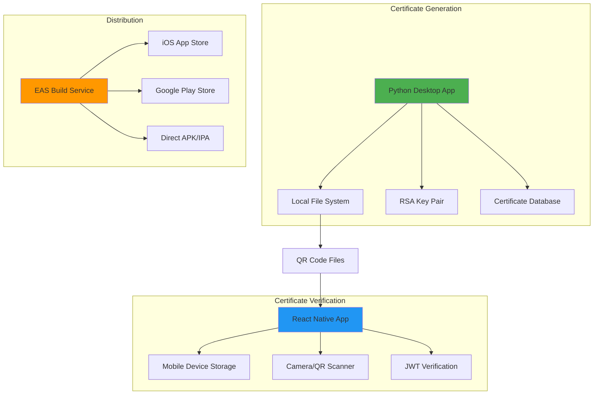

# 🚀 Deployment Guide - Certificate Verification System

**Version**: 1.0.0  
**Last Updated**: January 26, 2025  
**Team**: Oblivion - SIH 2025

---

## 📋 **Table of Contents**

1. [Deployment Overview](#-deployment-overview)
2. [Prerequisites](#-prerequisites)
3. [Python Certificate Generator Deployment](#-python-certificate-generator-deployment)
4. [React Native Mobile App Deployment](#-react-native-mobile-app-deployment)
5. [Environment Configuration](#-environment-configuration)
6. [Security Considerations](#-security-considerations)
7. [Monitoring and Logging](#-monitoring-and-logging)
8. [Backup and Recovery](#-backup-and-recovery)
9. [Performance Optimization](#-performance-optimization)
10. [Troubleshooting Deployment Issues](#-troubleshooting-deployment-issues)

---

## 🎯 **Deployment Overview**

The Certificate Verification System consists of two main components that can be deployed independently:

1. **Python Certificate Generator**: Desktop application for creating certificates
2. **React Native Mobile App**: Cross-platform mobile application for verifying certificates

### **Deployment Architecture**



### **Deployment Strategies**

| Component | Strategy | Environment | Complexity |
|-----------|----------|-------------|------------|
| **Python Generator** | Standalone Executable | Desktop/Server | Low |
| **React Native App** | App Store Distribution | Mobile Devices | Medium |
| **React Native App** | Direct Distribution | Enterprise/Testing | Low |
| **Web Version** | Progressive Web App | Web Browsers | High |

---

## ✅ **Prerequisites**

### **System Requirements**

#### **For Python Certificate Generator**
- **Operating System**: Windows 10/11, macOS 10.15+, Ubuntu 18.04+
- **Python**: 3.8 or higher
- **RAM**: Minimum 4GB, Recommended 8GB
- **Storage**: 500MB free space
- **Network**: Optional (for updates and key distribution)

#### **For React Native Mobile App**
- **iOS**: iOS 12.0 or higher
- **Android**: Android 8.0 (API level 26) or higher
- **Storage**: 50MB free space
- **Camera**: Required for QR code scanning
- **Network**: Optional (offline verification supported)

### **Development Tools**

#### **Python Development**
```bash
# Required Python packages
pip install cryptography>=3.4.8
pip install Pillow>=8.3.2
pip install qrcode>=7.3.1
pip install PyJWT>=2.4.0
pip install tkinter  # Usually included with Python
```

#### **React Native Development**
```bash
# Node.js and npm
node --version  # v16.0.0 or higher
npm --version   # v8.0.0 or higher

# Expo CLI
npm install -g @expo/cli

# EAS CLI (for building)
npm install -g eas-cli
```

### **Build Tools**

#### **For Python Executable**
```bash
# PyInstaller for creating executables
pip install pyinstaller

# Alternative: cx_Freeze
pip install cx_Freeze
```

#### **For Mobile App**
```bash
# Expo development build
expo install expo-dev-client

# For native builds
npm install -g react-native-cli
```

---

## 🐍 **Python Certificate Generator Deployment**

### **Development Environment Setup**

#### **1. Clone and Setup**
```bash
# Clone the repository
git clone <repository-url>
cd certificate-verification-system

# Navigate to Python scripts
cd python-scripts

# Create virtual environment
python -m venv certificate_env

# Activate virtual environment
# Windows:
certificate_env\Scripts\activate
# macOS/Linux:
source certificate_env/bin/activate

# Install dependencies
pip install -r requirements.txt
```

#### **2. Generate RSA Keys**
```bash
# Generate RSA key pair
python generate_keys.py

# Verify key generation
ls keys/
# Should show: private_key.pem, public_key.pem
```

#### **3. Test Certificate Generation**
```bash
# Test certificate generation
python certificate_generator.py

# Verify output
ls output/certificates/
# Should show generated certificates and QR codes
```

### **Production Deployment**

#### **Option 1: Standalone Executable (Recommended)**

##### **Using PyInstaller**
```bash
# Install PyInstaller
pip install pyinstaller

# Create executable
pyinstaller --onefile --windowed --name "CertificateGenerator" certificate_generator.py

# Add additional files
pyinstaller --onefile --windowed \
    --add-data "keys;keys" \
    --add-data "templates;templates" \
    --name "CertificateGenerator" \
    certificate_generator.py

# The executable will be in dist/CertificateGenerator.exe
```

##### **Advanced PyInstaller Configuration**
```python
# certificate_generator.spec
# -*- mode: python ; coding: utf-8 -*-

block_cipher = None

a = Analysis(
    ['certificate_generator.py'],
    pathex=[],
    binaries=[],
    datas=[
        ('keys', 'keys'),
        ('templates', 'templates'),
        ('requirements.txt', '.'),
    ],
    hiddenimports=[
        'cryptography',
        'PIL',
        'qrcode',
        'jwt',
        'tkinter'
    ],
    hookspath=[],
    hooksconfig={},
    runtime_hooks=[],
    excludes=[],
    win_no_prefer_redirects=False,
    win_private_assemblies=False,
    cipher=block_cipher,
    noarchive=False,
)

pyz = PYZ(a.pure, a.zipped_data, cipher=block_cipher)

exe = EXE(
    pyz,
    a.scripts,
    a.binaries,
    a.zipfiles,
    a.datas,
    [],
    name='CertificateGenerator',
    debug=False,
    bootloader_ignore_signals=False,
    strip=False,
    upx=True,
    upx_exclude=[],
    runtime_tmpdir=None,
    console=False,
    disable_windowed_traceback=False,
    argv_emulation=False,
    target_arch=None,
    codesign_identity=None,
    entitlements_file=None,
    icon='assets/icon.ico'  # Optional: Add application icon
)
```

```bash
# Build using spec file
pyinstaller certificate_generator.spec
```

#### **Option 2: Docker Deployment**

##### **Dockerfile**
```dockerfile
# Dockerfile
FROM python:3.9-slim

# Set working directory
WORKDIR /app

# Install system dependencies
RUN apt-get update && apt-get install -y \
    gcc \
    g++ \
    && rm -rf /var/lib/apt/lists/*

# Copy requirements and install Python dependencies
COPY requirements.txt .
RUN pip install --no-cache-dir -r requirements.txt

# Copy application code
COPY . .

# Create necessary directories
RUN mkdir -p keys output/certificates

# Set environment variables
ENV PYTHONPATH=/app
ENV CERTIFICATE_OUTPUT_DIR=/app/output/certificates

# Expose port (if running as web service)
EXPOSE 5000

# Run the application
CMD ["python", "certificate_generator.py"]
```

##### **Docker Compose**
```yaml
# docker-compose.yml
version: '3.8'

services:
  certificate-generator:
    build: .
    container_name: certificate_generator
    volumes:
      - ./keys:/app/keys
      - ./output:/app/output
      - ./config:/app/config
    environment:
      - ENVIRONMENT=production
      - LOG_LEVEL=INFO
    ports:
      - "5000:5000"
    restart: unless-stopped
    
  # Optional: Database for certificate storage
  database:
    image: postgres:13
    container_name: certificate_db
    environment:
      POSTGRES_DB: certificates
      POSTGRES_USER: cert_user
      POSTGRES_PASSWORD: secure_password
    volumes:
      - postgres_data:/var/lib/postgresql/data
    ports:
      - "5432:5432"

volumes:
  postgres_data:
```

```bash
# Deploy with Docker Compose
docker-compose up -d

# View logs
docker-compose logs -f certificate-generator

# Stop deployment
docker-compose down
```

#### **Option 3: Server Deployment**

##### **Systemd Service (Linux)**
```ini
# /etc/systemd/system/certificate-generator.service
[Unit]
Description=Certificate Generator Service
After=network.target

[Service]
Type=simple
User=certificate
Group=certificate
WorkingDirectory=/opt/certificate-generator
Environment=PATH=/opt/certificate-generator/venv/bin
ExecStart=/opt/certificate-generator/venv/bin/python certificate_generator.py
Restart=always
RestartSec=10

[Install]
WantedBy=multi-user.target
```

```bash
# Enable and start service
sudo systemctl enable certificate-generator
sudo systemctl start certificate-generator
sudo systemctl status certificate-generator
```

##### **Windows Service**
```python
# windows_service.py
import win32serviceutil
import win32service
import win32event
import servicemanager
import socket
import sys
import os

class CertificateGeneratorService(win32serviceutil.ServiceFramework):
    _svc_name_ = "CertificateGenerator"
    _svc_display_name_ = "Certificate Generator Service"
    _svc_description_ = "Generates secure certificates with QR codes"

    def __init__(self, args):
        win32serviceutil.ServiceFramework.__init__(self, args)
        self.hWaitStop = win32event.CreateEvent(None, 0, 0, None)
        socket.setdefaulttimeout(60)

    def SvcStop(self):
        self.ReportServiceStatus(win32service.SERVICE_STOP_PENDING)
        win32event.SetEvent(self.hWaitStop)

    def SvcDoRun(self):
        servicemanager.LogMsg(servicemanager.EVENTLOG_INFORMATION_TYPE,
                            servicemanager.PYS_SERVICE_STARTED,
                            (self._svc_name_, ''))
        self.main()

    def main(self):
        # Import and run your certificate generator
        from certificate_generator import main
        main()

if __name__ == '__main__':
    win32serviceutil.HandleCommandLine(CertificateGeneratorService)
```

### **Configuration Management**

#### **Environment Configuration**
```python
# config.py
import os
from pathlib import Path

class Config:
    # Base configuration
    BASE_DIR = Path(__file__).parent
    
    # Key management
    PRIVATE_KEY_PATH = os.getenv('PRIVATE_KEY_PATH', BASE_DIR / 'keys' / 'private_key.pem')
    PUBLIC_KEY_PATH = os.getenv('PUBLIC_KEY_PATH', BASE_DIR / 'keys' / 'public_key.pem')
    
    # Output configuration
    OUTPUT_DIR = os.getenv('OUTPUT_DIR', BASE_DIR / 'output' / 'certificates')
    
    # Certificate settings
    DEFAULT_VALIDITY_DAYS = int(os.getenv('DEFAULT_VALIDITY_DAYS', 365))
    DEFAULT_ISSUER = os.getenv('DEFAULT_ISSUER', 'Certificate Authority')
    
    # QR Code settings
    QR_ERROR_CORRECTION = os.getenv('QR_ERROR_CORRECTION', 'L')
    QR_BOX_SIZE = int(os.getenv('QR_BOX_SIZE', 10))
    QR_BORDER = int(os.getenv('QR_BORDER', 4))
    
    # Security settings
    JWT_ALGORITHM = os.getenv('JWT_ALGORITHM', 'RS256')
    INCLUDE_DEVICE_INFO = os.getenv('INCLUDE_DEVICE_INFO', 'true').lower() == 'true'

class DevelopmentConfig(Config):
    DEBUG = True
    LOG_LEVEL = 'DEBUG'

class ProductionConfig(Config):
    DEBUG = False
    LOG_LEVEL = 'INFO'
    
    # Production security enhancements
    REQUIRE_SECURE_KEYS = True
    ENABLE_AUDIT_LOGGING = True

# Configuration factory
def get_config():
    env = os.getenv('ENVIRONMENT', 'development')
    if env == 'production':
        return ProductionConfig()
    return DevelopmentConfig()
```

#### **Environment Variables**
```bash
# .env file for development
ENVIRONMENT=development
PRIVATE_KEY_PATH=./keys/private_key.pem
PUBLIC_KEY_PATH=./keys/public_key.pem
OUTPUT_DIR=./output/certificates
DEFAULT_VALIDITY_DAYS=365
DEFAULT_ISSUER=My Organization
LOG_LEVEL=DEBUG

# Production environment variables
ENVIRONMENT=production
PRIVATE_KEY_PATH=/secure/keys/private_key.pem
PUBLIC_KEY_PATH=/secure/keys/public_key.pem
OUTPUT_DIR=/data/certificates
DEFAULT_VALIDITY_DAYS=730
DEFAULT_ISSUER=Official Certificate Authority
LOG_LEVEL=INFO
ENABLE_AUDIT_LOGGING=true
```

---

## 📱 **React Native Mobile App Deployment**

### **Development Environment Setup**

#### **1. Project Setup**
```bash
# Navigate to React Native app directory
cd react-native-app

# Install dependencies
npm install

# Install iOS dependencies (macOS only)
cd ios && pod install && cd ..

# Start development server
npx expo start
```

#### **2. Development Testing**
```bash
# Test on iOS simulator (macOS only)
npx expo run:ios

# Test on Android emulator
npx expo run:android

# Test on physical device
npx expo start --tunnel
# Scan QR code with Expo Go app
```

### **Production Deployment**

#### **Option 1: Expo Application Services (EAS) - Recommended**

##### **EAS Configuration**
```json
// eas.json
{
  "cli": {
    "version": ">= 5.9.0"
  },
  "build": {
    "development": {
      "developmentClient": true,
      "distribution": "internal",
      "env": {
        "NODE_OPTIONS": "--max-old-space-size=4096"
      }
    },
    "preview": {
      "distribution": "internal",
      "ios": {
        "simulator": true
      },
      "android": {
        "buildType": "apk"
      },
      "env": {
        "NODE_OPTIONS": "--max-old-space-size=4096"
      }
    },
    "production": {
      "env": {
        "NODE_OPTIONS": "--max-old-space-size=4096"
      },
      "ios": {
        "bundleIdentifier": "com.oblivion.certificateverifier"
      },
      "android": {
        "buildType": "aab"
      }
    }
  },
  "submit": {
    "production": {
      "ios": {
        "appleId": "your-apple-id@example.com",
        "ascAppId": "your-app-store-connect-app-id",
        "appleTeamId": "your-apple-team-id"
      },
      "android": {
        "serviceAccountKeyPath": "./google-service-account.json",
        "track": "production"
      }
    }
  }
}
```

##### **Build Commands**
```bash
# Login to EAS
eas login

# Configure project
eas build:configure

# Build for development
eas build --profile development --platform all

# Build for preview/testing
eas build --profile preview --platform all

# Build for production
eas build --profile production --platform all

# Submit to app stores
eas submit --profile production --platform all
```

##### **Automated CI/CD with GitHub Actions**
```yaml
# .github/workflows/build-and-deploy.yml
name: Build and Deploy

on:
  push:
    branches: [main]
  pull_request:
    branches: [main]

jobs:
  build:
    runs-on: ubuntu-latest
    
    steps:
    - name: Checkout code
      uses: actions/checkout@v3
      
    - name: Setup Node.js
      uses: actions/setup-node@v3
      with:
        node-version: '18'
        cache: 'npm'
        cache-dependency-path: react-native-app/package-lock.json
        
    - name: Install dependencies
      working-directory: ./react-native-app
      run: npm ci
      
    - name: Setup EAS
      uses: expo/expo-github-action@v8
      with:
        eas-version: latest
        token: ${{ secrets.EXPO_TOKEN }}
        
    - name: Build preview
      working-directory: ./react-native-app
      run: eas build --profile preview --platform all --non-interactive
      
    - name: Build production (on main branch)
      if: github.ref == 'refs/heads/main'
      working-directory: ./react-native-app
      run: eas build --profile production --platform all --non-interactive
      
    - name: Submit to stores (on release tag)
      if: startsWith(github.ref, 'refs/tags/v')
      working-directory: ./react-native-app
      run: eas submit --profile production --platform all --non-interactive
```

#### **Option 2: Direct APK/IPA Distribution**

##### **Android APK Build**
```bash
# Build APK for direct distribution
eas build --profile preview --platform android

# Download APK
eas build:list
# Copy download URL and distribute directly
```

##### **iOS IPA Build (Enterprise)**
```bash
# Build IPA for enterprise distribution
eas build --profile preview --platform ios

# Configure for enterprise distribution
# Update eas.json with enterprise provisioning profile
```

#### **Option 3: Progressive Web App (PWA)**

##### **Expo Web Configuration**
```json
// app.json - Add web configuration
{
  "expo": {
    "name": "Certificate Verifier",
    "slug": "certificate-verifier",
    "platforms": ["ios", "android", "web"],
    "web": {
      "favicon": "./assets/favicon.png",
      "bundler": "metro",
      "output": "static",
      "lang": "en"
    }
  }
}
```

##### **PWA Deployment**
```bash
# Build for web
npx expo export:web

# Deploy to hosting service (example: Netlify)
npm install -g netlify-cli
netlify deploy --prod --dir web-build

# Deploy to Vercel
npm install -g vercel
vercel --prod web-build

# Deploy to Firebase Hosting
npm install -g firebase-tools
firebase deploy --only hosting
```

### **App Store Deployment**

#### **iOS App Store**

##### **Prerequisites**
- Apple Developer Account ($99/year)
- App Store Connect access
- Valid provisioning profiles
- App icons and screenshots

##### **Deployment Steps**
```bash
# 1. Build production iOS app
eas build --profile production --platform ios

# 2. Submit to App Store
eas submit --profile production --platform ios

# 3. Monitor submission status
eas submission:list
```

##### **App Store Connect Configuration**
1. **App Information**
   - App Name: Certificate Verifier
   - Bundle ID: com.oblivion.certificateverifier
   - Primary Language: English
   - Category: Utilities

2. **App Privacy**
   - Camera usage: QR code scanning
   - Local storage: Certificate caching
   - No data collection or sharing

3. **App Review Information**
   - Demo account (if needed)
   - Review notes explaining offline functionality
   - Contact information

#### **Google Play Store**

##### **Prerequisites**
- Google Play Developer Account ($25 one-time)
- Google Play Console access
- Signed AAB file
- Store listing assets

##### **Deployment Steps**
```bash
# 1. Build production Android app
eas build --profile production --platform android

# 2. Submit to Google Play
eas submit --profile production --platform android

# 3. Monitor submission status
eas submission:list
```

##### **Google Play Console Configuration**
1. **App Content**
   - Target audience: General audience
   - Content rating: Everyone
   - Privacy policy (if collecting data)

2. **Store Listing**
   - App name: Certificate Verifier
   - Short description: Secure offline certificate verification
   - Full description: Detailed app functionality
   - Screenshots and graphics

3. **Release Management**
   - Internal testing track
   - Closed testing (beta)
   - Open testing (if desired)
   - Production release

---

## ⚙️ **Environment Configuration**

### **Development Environment**

#### **Local Development Setup**
```bash
# Development environment variables
export NODE_ENV=development
export EXPO_DEBUG=true
export EXPO_DEVTOOLS=true

# Python development
export PYTHONPATH=$PWD/python-scripts
export CERTIFICATE_ENV=development
export LOG_LEVEL=DEBUG
```

#### **Development Configuration Files**
```json
// react-native-app/app.config.js
export default {
  expo: {
    name: process.env.NODE_ENV === 'production' ? 'Certificate Verifier' : 'Certificate Verifier (Dev)',
    slug: 'certificate-verifier',
    version: '1.0.0',
    orientation: 'portrait',
    icon: './assets/icon.png',
    userInterfaceStyle: 'light',
    splash: {
      image: './assets/splash.png',
      resizeMode: 'contain',
      backgroundColor: '#ffffff'
    },
    assetBundlePatterns: ['**/*'],
    ios: {
      supportsTablet: true,
      bundleIdentifier: process.env.NODE_ENV === 'production' 
        ? 'com.oblivion.certificateverifier' 
        : 'com.oblivion.certificateverifier.dev'
    },
    android: {
      adaptiveIcon: {
        foregroundImage: './assets/adaptive-icon.png',
        backgroundColor: '#FFFFFF'
      },
      package: process.env.NODE_ENV === 'production'
        ? 'com.oblivion.certificateverifier'
        : 'com.oblivion.certificateverifier.dev'
    },
    web: {
      favicon: './assets/favicon.png'
    },
    extra: {
      environment: process.env.NODE_ENV || 'development',
      apiUrl: process.env.API_URL || 'http://localhost:5000',
      enableLogging: process.env.NODE_ENV !== 'production'
    }
  }
};
```

### **Staging Environment**

#### **Staging Configuration**
```bash
# Staging environment setup
export NODE_ENV=staging
export API_URL=https://staging-api.certificateverifier.com
export ENABLE_ANALYTICS=false
export LOG_LEVEL=INFO

# EAS staging build
eas build --profile staging --platform all
```

#### **Staging Testing**
```bash
# Deploy to staging
eas build --profile staging

# Internal distribution for testing
eas build:list
# Share build URLs with testing team

# Automated testing
npm run test:e2e:staging
```

### **Production Environment**

#### **Production Configuration**
```bash
# Production environment variables
export NODE_ENV=production
export API_URL=https://api.certificateverifier.com
export ENABLE_ANALYTICS=true
export LOG_LEVEL=ERROR
export SENTRY_DSN=your-sentry-dsn

# Security settings
export CERTIFICATE_VALIDATION_STRICT=true
export ENABLE_CRASH_REPORTING=true
```

#### **Production Security**
```json
// Security configuration for production
{
  "security": {
    "certificateValidation": {
      "strictMode": true,
      "validateExpiry": true,
      "validateSignature": true,
      "validateIssuer": true
    },
    "storage": {
      "encryptLocalData": true,
      "secureKeyStorage": true
    },
    "network": {
      "certificatePinning": true,
      "requireHttps": true
    }
  }
}
```

---

## 🔒 **Security Considerations**

### **Key Management Security**

#### **Private Key Protection**
```bash
# Secure key storage permissions (Linux/macOS)
chmod 600 keys/private_key.pem
chown certificate:certificate keys/private_key.pem

# Windows ACL (PowerShell as Administrator)
icacls keys\private_key.pem /inheritance:d
icacls keys\private_key.pem /grant:r "certificate:(R)"
icacls keys\private_key.pem /remove "Users"
```

#### **Key Rotation Strategy**
```python
# key_rotation.py
import os
import shutil
from datetime import datetime, timedelta
from generate_keys import generate_rsa_keypair

class KeyRotationManager:
    def __init__(self, key_dir="keys", backup_dir="keys/backup"):
        self.key_dir = key_dir
        self.backup_dir = backup_dir
        os.makedirs(backup_dir, exist_ok=True)
    
    def rotate_keys(self):
        """Rotate RSA keys and backup old ones."""
        timestamp = datetime.now().strftime("%Y%m%d_%H%M%S")
        
        # Backup existing keys
        if os.path.exists(f"{self.key_dir}/private_key.pem"):
            shutil.copy2(
                f"{self.key_dir}/private_key.pem",
                f"{self.backup_dir}/private_key_{timestamp}.pem"
            )
            shutil.copy2(
                f"{self.key_dir}/public_key.pem",
                f"{self.backup_dir}/public_key_{timestamp}.pem"
            )
        
        # Generate new keys
        result = generate_rsa_keypair()
        
        if result["success"]:
            print(f"Keys rotated successfully. Backup saved with timestamp: {timestamp}")
            return True
        else:
            print(f"Key rotation failed: {result['error']}")
            return False
    
    def should_rotate_keys(self, max_age_days=90):
        """Check if keys should be rotated based on age."""
        private_key_path = f"{self.key_dir}/private_key.pem"
        
        if not os.path.exists(private_key_path):
            return True
        
        key_age = datetime.now() - datetime.fromtimestamp(
            os.path.getmtime(private_key_path)
        )
        
        return key_age > timedelta(days=max_age_days)

# Automated key rotation
if __name__ == "__main__":
    manager = KeyRotationManager()
    if manager.should_rotate_keys():
        manager.rotate_keys()
```

### **Application Security**

#### **Code Signing (iOS)**
```bash
# Configure code signing in eas.json
{
  "build": {
    "production": {
      "ios": {
        "bundleIdentifier": "com.oblivion.certificateverifier",
        "codeSigningSettings": {
          "automaticCodeSigning": false,
          "codeSigningCertificate": "iPhone Distribution",
          "codeSigningIdentity": "iPhone Distribution: Your Company Name",
          "provisioningProfilePath": "./provisioning/production.mobileprovision"
        }
      }
    }
  }
}
```

#### **Android App Signing**
```bash
# Generate signing key
keytool -genkey -v -keystore certificate-verifier.keystore \
  -alias certificate-verifier -keyalg RSA -keysize 2048 -validity 10000

# Configure signing in eas.json
{
  "build": {
    "production": {
      "android": {
        "buildType": "aab",
        "gradleCommand": ":app:bundleRelease"
      }
    }
  }
}
```

### **Runtime Security**

#### **Certificate Validation**
```javascript
// Enhanced certificate validation
export class SecureCertificateValidator {
  static validateCertificate(certificate) {
    const validations = [
      this.validateFormat(certificate),
      this.validateSignature(certificate),
      this.validateExpiry(certificate),
      this.validateIssuer(certificate),
      this.validateIntegrity(certificate)
    ];
    
    const failedValidations = validations.filter(v => !v.valid);
    
    return {
      valid: failedValidations.length === 0,
      errors: failedValidations.map(v => v.error),
      securityLevel: this.calculateSecurityLevel(validations)
    };
  }
  
  static validateIntegrity(certificate) {
    // Check for tampering indicators
    const expectedFields = [
      'certificate_id', 'holder_name', 'certificate_type',
      'issue_date', 'expiry_date', 'issuer'
    ];
    
    const missingFields = expectedFields.filter(
      field => !certificate.hasOwnProperty(field)
    );
    
    return {
      valid: missingFields.length === 0,
      error: missingFields.length > 0 
        ? `Missing required fields: ${missingFields.join(', ')}`
        : null
    };
  }
  
  static calculateSecurityLevel(validations) {
    const passedCount = validations.filter(v => v.valid).length;
    const totalCount = validations.length;
    const percentage = (passedCount / totalCount) * 100;
    
    if (percentage === 100) return 'HIGH';
    if (percentage >= 80) return 'MEDIUM';
    return 'LOW';
  }
}
```

### **Data Protection**

#### **Sensitive Data Handling**
```javascript
// Secure storage implementation
import * as SecureStore from 'expo-secure-store';
import CryptoJS from 'crypto-js';

export class SecureDataManager {
  static async storeSecurely(key, data) {
    try {
      // Encrypt data before storing
      const encrypted = CryptoJS.AES.encrypt(
        JSON.stringify(data), 
        await this.getEncryptionKey()
      ).toString();
      
      await SecureStore.setItemAsync(key, encrypted);
      return true;
    } catch (error) {
      console.error('Secure storage error:', error);
      return false;
    }
  }
  
  static async retrieveSecurely(key) {
    try {
      const encrypted = await SecureStore.getItemAsync(key);
      if (!encrypted) return null;
      
      const decrypted = CryptoJS.AES.decrypt(
        encrypted, 
        await this.getEncryptionKey()
      ).toString(CryptoJS.enc.Utf8);
      
      return JSON.parse(decrypted);
    } catch (error) {
      console.error('Secure retrieval error:', error);
      return null;
    }
  }
  
  static async getEncryptionKey() {
    // Generate or retrieve device-specific encryption key
    let key = await SecureStore.getItemAsync('encryption_key');
    
    if (!key) {
      key = CryptoJS.lib.WordArray.random(256/8).toString();
      await SecureStore.setItemAsync('encryption_key', key);
    }
    
    return key;
  }
}
```

---

## 📊 **Monitoring and Logging**

### **Application Monitoring**

#### **Python Application Logging**
```python
# logging_config.py
import logging
import logging.handlers
import os
from datetime import datetime

class CertificateLogger:
    def __init__(self, log_level='INFO', log_dir='logs'):
        self.log_dir = log_dir
        os.makedirs(log_dir, exist_ok=True)
        
        # Configure logging
        self.logger = logging.getLogger('CertificateGenerator')
        self.logger.setLevel(getattr(logging, log_level.upper()))
        
        # File handler with rotation
        log_file = os.path.join(log_dir, 'certificate_generator.log')
        file_handler = logging.handlers.RotatingFileHandler(
            log_file, maxBytes=10*1024*1024, backupCount=5
        )
        
        # Console handler
        console_handler = logging.StreamHandler()
        
        # Formatter
        formatter = logging.Formatter(
            '%(asctime)s - %(name)s - %(levelname)s - %(message)s'
        )
        file_handler.setFormatter(formatter)
        console_handler.setFormatter(formatter)
        
        self.logger.addHandler(file_handler)
        self.logger.addHandler(console_handler)
    
    def log_certificate_generation(self, certificate_id, holder_name, success=True, error=None):
        if success:
            self.logger.info(f"Certificate generated successfully: {certificate_id} for {holder_name}")
        else:
            self.logger.error(f"Certificate generation failed for {holder_name}: {error}")
    
    def log_key_operation(self, operation, success=True, error=None):
        if success:
            self.logger.info(f"Key operation completed: {operation}")
        else:
            self.logger.error(f"Key operation failed: {operation} - {error}")
    
    def log_security_event(self, event_type, details):
        self.logger.warning(f"Security event: {event_type} - {details}")

# Usage in certificate_generator.py
logger = CertificateLogger()

def create_certificate(certificate_data):
    try:
        # Certificate generation logic
        result = generate_certificate_logic(certificate_data)
        
        logger.log_certificate_generation(
            result['certificate_id'],
            certificate_data['holder_name'],
            success=True
        )
        
        return result
    except Exception as e:
        logger.log_certificate_generation(
            None,
            certificate_data.get('holder_name', 'Unknown'),
            success=False,
            error=str(e)
        )
        raise
```

#### **React Native Application Monitoring**
```javascript
// monitoring.js
import * as Sentry from '@sentry/react-native';
import { Analytics } from 'expo-analytics';

// Initialize Sentry for error tracking
Sentry.init({
  dsn: 'YOUR_SENTRY_DSN',
  environment: __DEV__ ? 'development' : 'production',
});

// Initialize Analytics
const analytics = new Analytics('YOUR_ANALYTICS_ID');

export class AppMonitoring {
  static logCertificateVerification(certificateId, success, error = null) {
    const event = {
      action: 'certificate_verification',
      certificate_id: certificateId,
      success: success,
      timestamp: new Date().toISOString()
    };
    
    if (success) {
      console.log('Certificate verified successfully:', certificateId);
      analytics.track('certificate_verified', event);
    } else {
      console.error('Certificate verification failed:', error);
      Sentry.captureException(new Error(`Certificate verification failed: ${error}`));
      analytics.track('certificate_verification_failed', { ...event, error });
    }
  }
  
  static logQRScan(success, error = null) {
    const event = {
      action: 'qr_scan',
      success: success,
      timestamp: new Date().toISOString()
    };
    
    if (success) {
      analytics.track('qr_scan_success', event);
    } else {
      console.error('QR scan failed:', error);
      Sentry.captureException(new Error(`QR scan failed: ${error}`));
      analytics.track('qr_scan_failed', { ...event, error });
    }
  }
  
  static logAppPerformance(action, duration) {
    const event = {
      action: action,
      duration: duration,
      timestamp: new Date().toISOString()
    };
    
    analytics.track('performance_metric', event);
    
    // Log slow operations
    if (duration > 5000) { // 5 seconds
      Sentry.captureMessage(`Slow operation detected: ${action} took ${duration}ms`);
    }
  }
}

// Performance monitoring hook
export function usePerformanceMonitoring() {
  const measurePerformance = (action, asyncFunction) => {
    return async (...args) => {
      const startTime = Date.now();
      try {
        const result = await asyncFunction(...args);
        const duration = Date.now() - startTime;
        AppMonitoring.logAppPerformance(action, duration);
        return result;
      } catch (error) {
        const duration = Date.now() - startTime;
        AppMonitoring.logAppPerformance(`${action}_error`, duration);
        throw error;
      }
    };
  };
  
  return { measurePerformance };
}
```

### **System Monitoring**

#### **Health Check Endpoints**
```python
# health_check.py
from flask import Flask, jsonify
import psutil
import os
from datetime import datetime

app = Flask(__name__)

@app.route('/health')
def health_check():
    """Basic health check endpoint."""
    return jsonify({
        'status': 'healthy',
        'timestamp': datetime.now().isoformat(),
        'version': '1.0.0'
    })

@app.route('/health/detailed')
def detailed_health_check():
    """Detailed health check with system metrics."""
    try:
        # System metrics
        cpu_percent = psutil.cpu_percent(interval=1)
        memory = psutil.virtual_memory()
        disk = psutil.disk_usage('/')
        
        # Application-specific checks
        keys_exist = (
            os.path.exists('keys/private_key.pem') and 
            os.path.exists('keys/public_key.pem')
        )
        
        output_dir_writable = os.access('output/certificates', os.W_OK)
        
        health_status = {
            'status': 'healthy',
            'timestamp': datetime.now().isoformat(),
            'system': {
                'cpu_percent': cpu_percent,
                'memory_percent': memory.percent,
                'disk_percent': (disk.used / disk.total) * 100,
                'available_memory_mb': memory.available / (1024 * 1024)
            },
            'application': {
                'keys_available': keys_exist,
                'output_directory_writable': output_dir_writable,
                'certificates_generated_today': count_todays_certificates()
            }
        }
        
        # Determine overall health
        if (cpu_percent > 90 or memory.percent > 90 or 
            not keys_exist or not output_dir_writable):
            health_status['status'] = 'unhealthy'
        elif cpu_percent > 70 or memory.percent > 70:
            health_status['status'] = 'degraded'
        
        return jsonify(health_status)
        
    except Exception as e:
        return jsonify({
            'status': 'error',
            'error': str(e),
            'timestamp': datetime.now().isoformat()
        }), 500

def count_todays_certificates():
    """Count certificates generated today."""
    today = datetime.now().strftime('%Y%m%d')
    cert_dir = 'output/certificates'
    
    if not os.path.exists(cert_dir):
        return 0
    
    count = 0
    for filename in os.listdir(cert_dir):
        if filename.startswith(f'cert_{today}'):
            count += 1
    
    return count

if __name__ == '__main__':
    app.run(host='0.0.0.0', port=8080)
```

#### **Monitoring Dashboard**
```python
# monitoring_dashboard.py
import streamlit as st
import pandas as pd
import plotly.express as px
import plotly.graph_objects as go
from datetime import datetime, timedelta
import os
import json

st.set_page_config(
    page_title="Certificate System Monitoring",
    page_icon="📊",
    layout="wide"
)

st.title("📊 Certificate Verification System - Monitoring Dashboard")

# Sidebar for controls
st.sidebar.header("Dashboard Controls")
refresh_interval = st.sidebar.selectbox(
    "Refresh Interval",
    [30, 60, 300, 600],  # seconds
    index=1
)

# Auto-refresh
if st.sidebar.button("Refresh Now"):
    st.experimental_rerun()

# Main metrics
col1, col2, col3, col4 = st.columns(4)

with col1:
    st.metric(
        label="Certificates Generated Today",
        value=get_certificates_count_today(),
        delta=get_certificates_delta()
    )

with col2:
    st.metric(
        label="System Health",
        value=get_system_health_status(),
        delta=None
    )

with col3:
    st.metric(
        label="Active Users",
        value=get_active_users_count(),
        delta=get_users_delta()
    )

with col4:
    st.metric(
        label="Success Rate",
        value=f"{get_success_rate():.1f}%",
        delta=f"{get_success_rate_delta():.1f}%"
    )

# Charts
col1, col2 = st.columns(2)

with col1:
    st.subheader("Certificate Generation Trend")
    chart_data = get_certificate_trend_data()
    fig = px.line(chart_data, x='date', y='count', title='Daily Certificate Generation')
    st.plotly_chart(fig, use_container_width=True)

with col2:
    st.subheader("System Performance")
    perf_data = get_performance_data()
    fig = go.Figure()
    fig.add_trace(go.Scatter(x=perf_data['time'], y=perf_data['cpu'], name='CPU %'))
    fig.add_trace(go.Scatter(x=perf_data['time'], y=perf_data['memory'], name='Memory %'))
    fig.update_layout(title='System Resource Usage')
    st.plotly_chart(fig, use_container_width=True)

# Recent activity
st.subheader("Recent Activity")
recent_logs = get_recent_logs()
st.dataframe(recent_logs, use_container_width=True)

# Helper functions (implement based on your logging system)
def get_certificates_count_today():
    # Implementation to count today's certificates
    return 42

def get_certificates_delta():
    # Implementation to get change from yesterday
    return 5

def get_system_health_status():
    # Implementation to check system health
    return "Healthy"

# ... other helper functions
```

---

## 💾 **Backup and Recovery**

### **Data Backup Strategy**

#### **Automated Backup Script**
```python
# backup_manager.py
import os
import shutil
import zipfile
import boto3
from datetime import datetime, timedelta
import logging

class BackupManager:
    def __init__(self, config):
        self.config = config
        self.logger = logging.getLogger(__name__)
        
        # AWS S3 client (optional)
        if config.get('aws_enabled'):
            self.s3_client = boto3.client(
                's3',
                aws_access_key_id=config['aws_access_key'],
                aws_secret_access_key=config['aws_secret_key'],
                region_name=config['aws_region']
            )
    
    def create_backup(self):
        """Create a complete system backup."""
        timestamp = datetime.now().strftime('%Y%m%d_%H%M%S')
        backup_name = f"certificate_system_backup_{timestamp}"
        backup_dir = os.path.join(self.config['backup_dir'], backup_name)
        
        try:
            os.makedirs(backup_dir, exist_ok=True)
            
            # Backup components
            self._backup_keys(backup_dir)
            self._backup_certificates(backup_dir)
            self._backup_configuration(backup_dir)
            self._backup_logs(backup_dir)
            
            # Create compressed archive
            archive_path = f"{backup_dir}.zip"
            self._create_archive(backup_dir, archive_path)
            
            # Upload to cloud storage (if configured)
            if self.config.get('aws_enabled'):
                self._upload_to_s3(archive_path, backup_name)
            
            # Cleanup old backups
            self._cleanup_old_backups()
            
            self.logger.info(f"Backup created successfully: {backup_name}")
            return True
            
        except Exception as e:
            self.logger.error(f"Backup failed: {str(e)}")
            return False
    
    def _backup_keys(self, backup_dir):
        """Backup RSA keys."""
        keys_backup_dir = os.path.join(backup_dir, 'keys')
        os.makedirs(keys_backup_dir, exist_ok=True)
        
        for key_file in ['private_key.pem', 'public_key.pem']:
            src = os.path.join('keys', key_file)
            if os.path.exists(src):
                shutil.copy2(src, keys_backup_dir)
    
    def _backup_certificates(self, backup_dir):
        """Backup generated certificates."""
        cert_backup_dir = os.path.join(backup_dir, 'certificates')
        
        if os.path.exists('output/certificates'):
            shutil.copytree('output/certificates', cert_backup_dir)
    
    def _backup_configuration(self, backup_dir):
        """Backup configuration files."""
        config_files = [
            'config.py',
            'requirements.txt',
            '.env',
            'eas.json'
        ]
        
        config_backup_dir = os.path.join(backup_dir, 'config')
        os.makedirs(config_backup_dir, exist_ok=True)
        
        for config_file in config_files:
            if os.path.exists(config_file):
                shutil.copy2(config_file, config_backup_dir)
    
    def _backup_logs(self, backup_dir):
        """Backup log files."""
        logs_backup_dir = os.path.join(backup_dir, 'logs')
        
        if os.path.exists('logs'):
            shutil.copytree('logs', logs_backup_dir)
    
    def _create_archive(self, source_dir, archive_path):
        """Create compressed archive."""
        with zipfile.ZipFile(archive_path, 'w', zipfile.ZIP_DEFLATED) as zipf:
            for root, dirs, files in os.walk(source_dir):
                for file in files:
                    file_path = os.path.join(root, file)
                    arcname = os.path.relpath(file_path, source_dir)
                    zipf.write(file_path, arcname)
        
        # Remove uncompressed directory
        shutil.rmtree(source_dir)
    
    def _upload_to_s3(self, file_path, backup_name):
        """Upload backup to AWS S3."""
        try:
            s3_key = f"backups/{backup_name}.zip"
            self.s3_client.upload_file(
                file_path,
                self.config['s3_bucket'],
                s3_key
            )
            self.logger.info(f"Backup uploaded to S3: {s3_key}")
        except Exception as e:
            self.logger.error(f"S3 upload failed: {str(e)}")
    
    def _cleanup_old_backups(self):
        """Remove old backup files."""
        retention_days = self.config.get('backup_retention_days', 30)
        cutoff_date = datetime.now() - timedelta(days=retention_days)
        
        backup_dir = self.config['backup_dir']
        
        for filename in os.listdir(backup_dir):
            if filename.startswith('certificate_system_backup_'):
                file_path = os.path.join(backup_dir, filename)
                file_date = datetime.fromtimestamp(os.path.getctime(file_path))
                
                if file_date < cutoff_date:
                    os.remove(file_path)
                    self.logger.info(f"Removed old backup: {filename}")

# Backup configuration
backup_config = {
    'backup_dir': '/backups',
    'backup_retention_days': 30,
    'aws_enabled': True,
    'aws_access_key': os.getenv('AWS_ACCESS_KEY_ID'),
    'aws_secret_key': os.getenv('AWS_SECRET_ACCESS_KEY'),
    'aws_region': 'us-east-1',
    's3_bucket': 'certificate-system-backups'
}

# Automated backup (run daily)
if __name__ == "__main__":
    backup_manager = BackupManager(backup_config)
    backup_manager.create_backup()
```

#### **Backup Scheduling**
```bash
# Cron job for daily backups (Linux/macOS)
# Add to crontab: crontab -e
0 2 * * * /usr/bin/python3 /opt/certificate-generator/backup_manager.py

# Windows Task Scheduler (PowerShell)
$action = New-ScheduledTaskAction -Execute "python" -Argument "C:\CertificateGenerator\backup_manager.py"
$trigger = New-ScheduledTaskTrigger -Daily -At 2:00AM
$settings = New-ScheduledTaskSettingsSet -AllowStartIfOnBatteries -DontStopIfGoingOnBatteries
Register-ScheduledTask -TaskName "CertificateBackup" -Action $action -Trigger $trigger -Settings $settings
```

### **Disaster Recovery**

#### **Recovery Procedures**
```python
# recovery_manager.py
import os
import shutil
import zipfile
import boto3
from datetime import datetime
import logging

class RecoveryManager:
    def __init__(self, config):
        self.config = config
        self.logger = logging.getLogger(__name__)
        
        if config.get('aws_enabled'):
            self.s3_client = boto3.client(
                's3',
                aws_access_key_id=config['aws_access_key'],
                aws_secret_access_key=config['aws_secret_key'],
                region_name=config['aws_region']
            )
    
    def list_available_backups(self):
        """List all available backups."""
        backups = []
        
        # Local backups
        backup_dir = self.config['backup_dir']
        if os.path.exists(backup_dir):
            for filename in os.listdir(backup_dir):
                if filename.startswith('certificate_system_backup_') and filename.endswith('.zip'):
                    file_path = os.path.join(backup_dir, filename)
                    file_date = datetime.fromtimestamp(os.path.getctime(file_path))
                    backups.append({
                        'name': filename,
                        'date': file_date,
                        'location': 'local',
                        'path': file_path
                    })
        
        # S3 backups
        if self.config.get('aws_enabled'):
            try:
                response = self.s3_client.list_objects_v2(
                    Bucket=self.config['s3_bucket'],
                    Prefix='backups/'
                )
                
                for obj in response.get('Contents', []):
                    backups.append({
                        'name': os.path.basename(obj['Key']),
                        'date': obj['LastModified'],
                        'location': 's3',
                        'path': obj['Key']
                    })
            except Exception as e:
                self.logger.error(f"Failed to list S3 backups: {str(e)}")
        
        return sorted(backups, key=lambda x: x['date'], reverse=True)
    
    def restore_from_backup(self, backup_name, restore_dir=None):
        """Restore system from backup."""
        if restore_dir is None:
            restore_dir = os.getcwd()
        
        try:
            # Find backup
            backups = self.list_available_backups()
            backup = next((b for b in backups if b['name'] == backup_name), None)
            
            if not backup:
                raise Exception(f"Backup not found: {backup_name}")
            
            # Download from S3 if needed
            if backup['location'] == 's3':
                local_path = os.path.join('/tmp', backup_name)
                self.s3_client.download_file(
                    self.config['s3_bucket'],
                    backup['path'],
                    local_path
                )
                backup_path = local_path
            else:
                backup_path = backup['path']
            
            # Extract backup
            with zipfile.ZipFile(backup_path, 'r') as zipf:
                zipf.extractall(restore_dir)
            
            self.logger.info(f"System restored from backup: {backup_name}")
            return True
            
        except Exception as e:
            self.logger.error(f"Restore failed: {str(e)}")
            return False
    
    def verify_backup_integrity(self, backup_name):
        """Verify backup file integrity."""
        try:
            backups = self.list_available_backups()
            backup = next((b for b in backups if b['name'] == backup_name), None)
            
            if not backup:
                return False, "Backup not found"
            
            # Download from S3 if needed
            if backup['location'] == 's3':
                local_path = os.path.join('/tmp', backup_name)
                self.s3_client.download_file(
                    self.config['s3_bucket'],
                    backup['path'],
                    local_path
                )
                backup_path = local_path
            else:
                backup_path = backup['path']
            
            # Test zip file integrity
            with zipfile.ZipFile(backup_path, 'r') as zipf:
                bad_files = zipf.testzip()
                if bad_files:
                    return False, f"Corrupted files: {bad_files}"
            
            return True, "Backup integrity verified"
            
        except Exception as e:
            return False, str(e)

# Recovery CLI
if __name__ == "__main__":
    import argparse
    
    parser = argparse.ArgumentParser(description='Certificate System Recovery')
    parser.add_argument('--list', action='store_true', help='List available backups')
    parser.add_argument('--restore', type=str, help='Restore from backup')
    parser.add_argument('--verify', type=str, help='Verify backup integrity')
    
    args = parser.parse_args()
    
    recovery_config = {
        'backup_dir': '/backups',
        'aws_enabled': True,
        'aws_access_key': os.getenv('AWS_ACCESS_KEY_ID'),
        'aws_secret_key': os.getenv('AWS_SECRET_ACCESS_KEY'),
        'aws_region': 'us-east-1',
        's3_bucket': 'certificate-system-backups'
    }
    
    recovery_manager = RecoveryManager(recovery_config)
    
    if args.list:
        backups = recovery_manager.list_available_backups()
        print("Available backups:")
        for backup in backups:
            print(f"  {backup['name']} - {backup['date']} ({backup['location']})")
    
    elif args.restore:
        success = recovery_manager.restore_from_backup(args.restore)
        if success:
            print(f"Successfully restored from {args.restore}")
        else:
            print(f"Failed to restore from {args.restore}")
    
    elif args.verify:
        valid, message = recovery_manager.verify_backup_integrity(args.verify)
        print(f"Backup verification: {message}")
```

---

## ⚡ **Performance Optimization**

### **Python Application Optimization**

#### **Certificate Generation Performance**
```python
# performance_optimized_generator.py
import concurrent.futures
import multiprocessing
from functools import lru_cache
import time

class OptimizedCertificateGenerator:
    def __init__(self, max_workers=None):
        self.max_workers = max_workers or multiprocessing.cpu_count()
        self._private_key_cache = None
        self._public_key_cache = None
    
    @lru_cache(maxsize=1)
    def get_private_key(self):
        """Cache private key to avoid repeated file I/O."""
        if self._private_key_cache is None:
            with open('keys/private_key.pem', 'rb') as f:
                self._private_key_cache = serialization.load_pem_private_key(
                    f.read(), password=None, backend=default_backend()
                )
        return self._private_key_cache
    
    def generate_certificates_batch(self, certificate_data_list):
        """Generate multiple certificates in parallel."""
        start_time = time.time()
        
        with concurrent.futures.ThreadPoolExecutor(max_workers=self.max_workers) as executor:
            # Submit all certificate generation tasks
            future_to_data = {
                executor.submit(self.create_certificate, cert_data): cert_data
                for cert_data in certificate_data_list
            }
            
            results = []
            for future in concurrent.futures.as_completed(future_to_data):
                cert_data = future_to_data[future]
                try:
                    result = future.result()
                    results.append(result)
                except Exception as e:
                    print(f"Certificate generation failed for {cert_data.get('holder_name', 'Unknown')}: {e}")
                    results.append({
                        'success': False,
                        'error': str(e),
                        'certificate_data': cert_data
                    })
        
        end_time = time.time()
        print(f"Generated {len(results)} certificates in {end_time - start_time:.2f} seconds")
        
        return results
    
    def create_certificate_optimized(self, certificate_data):
        """Optimized single certificate generation."""
        # Use cached private key
        private_key = self.get_private_key()
        
        # Pre-generate device info (cache if same device)
        device_info = self.get_cached_device_info()
        
        # Generate certificate with optimizations
        return self._generate_certificate_internal(certificate_data, private_key, device_info)
    
    @lru_cache(maxsize=1)
    def get_cached_device_info(self):
        """Cache device info to avoid repeated system calls."""
        return get_device_info()

# Performance monitoring decorator
def monitor_performance(func):
    def wrapper(*args, **kwargs):
        start_time = time.time()
        start_memory = psutil.Process().memory_info().rss / 1024 / 1024  # MB
        
        result = func(*args, **kwargs)
        
        end_time = time.time()
        end_memory = psutil.Process().memory_info().rss / 1024 / 1024  # MB
        
        print(f"Function {func.__name__}:")
        print(f"  Execution time: {end_time - start_time:.2f} seconds")
        print(f"  Memory usage: {end_memory - start_memory:.2f} MB")
        
        return result
    return wrapper

# Usage
@monitor_performance
def generate_batch_certificates():
    generator = OptimizedCertificateGenerator()
    
    # Sample data for batch generation
    certificate_data_list = [
        {
            "holder_name": f"Student {i}",
            "certificate_type": "Course Completion",
            "issuer": "Online University"
        }
        for i in range(100)
    ]
    
    return generator.generate_certificates_batch(certificate_data_list)
```

### **React Native App Optimization**

#### **Performance Optimizations**
```javascript
// optimizations.js
import { memo, useMemo, useCallback } from 'react';
import { InteractionManager } from 'react-native';

// Memoized certificate component
export const CertificateItem = memo(({ certificate, onPress }) => {
  const formattedDate = useMemo(() => {
    return new Date(certificate.issue_date).toLocaleDateString();
  }, [certificate.issue_date]);
  
  const handlePress = useCallback(() => {
    onPress(certificate);
  }, [certificate, onPress]);
  
  return (
    <TouchableOpacity onPress={handlePress} style={styles.certificateItem}>
      <Text style={styles.holderName}>{certificate.holder_name}</Text>
      <Text style={styles.certificateType}>{certificate.certificate_type}</Text>
      <Text style={styles.issueDate}>{formattedDate}</Text>
    </TouchableOpacity>
  );
});

// Optimized certificate list with virtualization
import { FlatList } from 'react-native';

export const CertificateList = ({ certificates, onCertificatePress }) => {
  const renderCertificate = useCallback(({ item }) => (
    <CertificateItem certificate={item} onPress={onCertificatePress} />
  ), [onCertificatePress]);
  
  const keyExtractor = useCallback((item) => item.certificate_id, []);
  
  return (
    <FlatList
      data={certificates}
      renderItem={renderCertificate}
      keyExtractor={keyExtractor}
      removeClippedSubviews={true}
      maxToRenderPerBatch={10}
      updateCellsBatchingPeriod={50}
      initialNumToRender={10}
      windowSize={10}
      getItemLayout={(data, index) => ({
        length: 80,
        offset: 80 * index,
        index,
      })}
    />
  );
};

// Optimized QR scanner with performance improvements
export const OptimizedQRScanner = () => {
  const [hasPermission, setHasPermission] = useState(null);
  const [scanned, setScanned] = useState(false);
  
  useEffect(() => {
    const getBarCodeScannerPermissions = async () => {
      const { status } = await BarCodeScanner.requestPermissionsAsync();
      setHasPermission(status === 'granted');
    };

    getBarCodeScannerPermissions();
  }, []);

  const handleBarCodeScanned = useCallback(({ type, data }) => {
    if (scanned) return;
    
    setScanned(true);
    
    // Use InteractionManager to defer heavy operations
    InteractionManager.runAfterInteractions(() => {
      processQRCode(data);
    });
  }, [scanned]);

  const resetScanner = useCallback(() => {
    setScanned(false);
  }, []);

  if (hasPermission === null) {
    return <Text>Requesting camera permission</Text>;
  }
  if (hasPermission === false) {
    return <Text>No access to camera</Text>;
  }

  return (
    <View style={styles.container}>
      <BarCodeScanner
        onBarCodeScanned={scanned ? undefined : handleBarCodeScanned}
        style={StyleSheet.absoluteFillObject}
        barCodeTypes={[BarCodeScanner.Constants.BarCodeType.qr]}
      />
      {scanned && (
        <Button title={'Tap to Scan Again'} onPress={resetScanner} />
      )}
    </View>
  );
};

// Image optimization for certificates
import { Image } from 'expo-image';

export const OptimizedCertificateImage = ({ uri, style }) => {
  return (
    <Image
      source={{ uri }}
      style={style}
      contentFit="cover"
      transition={200}
      cachePolicy="memory-disk"
    />
  );
};
```

#### **Bundle Size Optimization**
```javascript
// metro.config.js - Optimized Metro configuration
const { getDefaultConfig } = require('expo/metro-config');

const config = getDefaultConfig(__dirname);

// Enable tree shaking
config.resolver.platforms = ['ios', 'android', 'native', 'web'];

// Optimize bundle splitting
config.serializer.customSerializer = require('@expo/metro-serializer-esbuild');

// Exclude unnecessary files
config.resolver.blacklistRE = /node_modules\/.*\/(tests?|__tests__|test|spec)\/.*/;

// Asset optimization
config.transformer.assetPlugins = ['expo-asset/tools/hashAssetFiles'];

module.exports = config;
```

---

## 🔧 **Troubleshooting Deployment Issues**

### **Common Python Deployment Issues**

#### **Issue 1: Missing Dependencies**
```bash
# Problem: ModuleNotFoundError when running executable
# Solution: Ensure all dependencies are included

# Check missing modules
python -c "import sys; print(sys.path)"

# Rebuild with hidden imports
pyinstaller --onefile --hidden-import=cryptography --hidden-import=PIL certificate_generator.py
```

#### **Issue 2: Key File Access Errors**
```python
# Problem: Permission denied when accessing key files
# Solution: Check file permissions and paths

import os
import stat

def fix_key_permissions():
    key_files = ['keys/private_key.pem', 'keys/public_key.pem']
    
    for key_file in key_files:
        if os.path.exists(key_file):
            # Set read-only permissions for owner
            os.chmod(key_file, stat.S_IRUSR)
            print(f"Fixed permissions for {key_file}")
        else:
            print(f"Key file not found: {key_file}")
            # Generate missing keys
            from generate_keys import generate_rsa_keypair
            generate_rsa_keypair()

if __name__ == "__main__":
    fix_key_permissions()
```

#### **Issue 3: GUI Application Not Starting**
```python
# Problem: Tkinter GUI not displaying
# Solution: Check display environment and dependencies

import tkinter as tk
import sys
import os

def diagnose_gui_issues():
    try:
        # Test basic Tkinter functionality
        root = tk.Tk()
        root.withdraw()  # Hide window
        
        # Check display environment (Linux)
        if sys.platform.startswith('linux'):
            display = os.environ.get('DISPLAY')
            if not display:
                print("ERROR: DISPLAY environment variable not set")
                print("Solution: export DISPLAY=:0.0")
                return False
        
        print("GUI environment check passed")
        return True
        
    except tk.TclError as e:
        print(f"Tkinter error: {e}")
        print("Solution: Install tkinter package or check X11 forwarding")
        return False
    except Exception as e:
        print(f"Unexpected GUI error: {e}")
        return False

if __name__ == "__main__":
    diagnose_gui_issues()
```

### **Common React Native Deployment Issues**

#### **Issue 1: EAS Build Failures**
```bash
# Problem: Build fails with credential errors
# Solution: Configure credentials properly

# Check EAS credentials
eas credentials

# Configure iOS credentials
eas credentials:configure -p ios

# Configure Android credentials
eas credentials:configure -p android

# Clear credentials and reconfigure
eas credentials:delete
eas build:configure
```

#### **Issue 2: Metro Bundle Errors**
```bash
# Problem: Metro bundler fails to resolve modules
# Solution: Clear cache and reinstall dependencies

# Clear Metro cache
npx expo start --clear

# Clear npm cache
npm cache clean --force

# Reinstall dependencies
rm -rf node_modules package-lock.json
npm install

# Reset Expo cache
npx expo install --fix
```

#### **Issue 3: Camera Permission Issues**
```javascript
// Problem: Camera not working on device
// Solution: Check permissions and configuration

import { Camera } from 'expo-camera';
import { Alert } from 'react-native';

export const diagnoseCameraIssues = async () => {
  try {
    // Check camera availability
    const isAvailable = await Camera.isAvailableAsync();
    if (!isAvailable) {
      Alert.alert('Error', 'Camera not available on this device');
      return false;
    }
    
    // Check permissions
    const { status } = await Camera.requestCameraPermissionsAsync();
    if (status !== 'granted') {
      Alert.alert(
        'Permission Required',
        'Camera permission is required to scan QR codes',
        [
          { text: 'Cancel', style: 'cancel' },
          { text: 'Open Settings', onPress: () => Linking.openSettings() }
        ]
      );
      return false;
    }
    
    console.log('Camera diagnostics passed');
    return true;
    
  } catch (error) {
    console.error('Camera diagnostic error:', error);
    Alert.alert('Error', 'Failed to initialize camera');
    return false;
  }
};
```

### **Performance Troubleshooting**

#### **Memory Usage Monitoring**
```python
# memory_monitor.py
import psutil
import time
import matplotlib.pyplot as plt
from datetime import datetime

class MemoryMonitor:
    def __init__(self):
        self.memory_usage = []
        self.timestamps = []
    
    def start_monitoring(self, duration_minutes=10):
        """Monitor memory usage for specified duration."""
        end_time = time.time() + (duration_minutes * 60)
        
        while time.time() < end_time:
            # Get current memory usage
            process = psutil.Process()
            memory_mb = process.memory_info().rss / 1024 / 1024
            
            self.memory_usage.append(memory_mb)
            self.timestamps.append(datetime.now())
            
            print(f"Memory usage: {memory_mb:.2f} MB")
            time.sleep(10)  # Check every 10 seconds
        
        self.generate_report()
    
    def generate_report(self):
        """Generate memory usage report."""
        if not self.memory_usage:
            print("No memory data collected")
            return
        
        avg_memory = sum(self.memory_usage) / len(self.memory_usage)
        max_memory = max(self.memory_usage)
        min_memory = min(self.memory_usage)
        
        print(f"\nMemory Usage Report:")
        print(f"Average: {avg_memory:.2f} MB")
        print(f"Maximum: {max_memory:.2f} MB")
        print(f"Minimum: {min_memory:.2f} MB")
        
        # Create graph
        plt.figure(figsize=(12, 6))
        plt.plot(self.timestamps, self.memory_usage)
        plt.title('Memory Usage Over Time')
        plt.xlabel('Time')
        plt.ylabel('Memory Usage (MB)')
        plt.xticks(rotation=45)
        plt.tight_layout()
        plt.savefig('memory_usage_report.png')
        print("Memory usage graph saved as 'memory_usage_report.png'")

if __name__ == "__main__":
    monitor = MemoryMonitor()
    monitor.start_monitoring(duration_minutes=5)
```

### **Deployment Checklist**

#### **Pre-Deployment Checklist**
- [ ] All dependencies installed and tested
- [ ] RSA keys generated and secured
- [ ] Configuration files updated for production
- [ ] Security settings configured
- [ ] Backup procedures tested
- [ ] Monitoring systems configured
- [ ] Performance benchmarks established
- [ ] Documentation updated

#### **Post-Deployment Checklist**
- [ ] Application starts successfully
- [ ] All features working as expected
- [ ] Security measures active
- [ ] Monitoring systems reporting
- [ ] Backup systems operational
- [ ] Performance within acceptable limits
- [ ] User access and permissions configured
- [ ] Support procedures documented

---

## 📞 **Support and Maintenance**

### **Support Contacts**
- **Technical Support**: support@certificateverifier.com
- **Emergency Contact**: +1-XXX-XXX-XXXX
- **Documentation**: https://docs.certificateverifier.com

### **Maintenance Schedule**
- **Daily**: Automated backups, log rotation
- **Weekly**: Security updates, performance monitoring
- **Monthly**: Key rotation (if configured), system updates
- **Quarterly**: Full system audit, disaster recovery testing

### **Version Management**
- **Current Version**: 1.0.0
- **Update Policy**: Security patches within 24 hours, feature updates monthly
- **Rollback Procedures**: Automated rollback on deployment failure

---

**© 2025 Team Oblivion - SIH 2025. All rights reserved.**