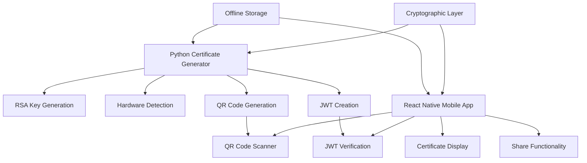
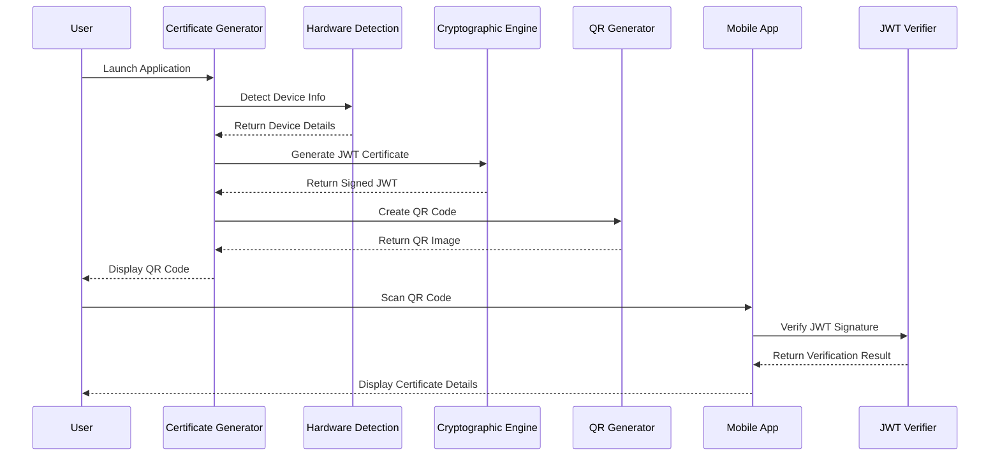

# 🛠️ Developer Manual - Certificate Verification System


---

## 📋 **Table of Contents**

1. [Development Environment Setup](#-development-environment-setup)
2. [Architecture Overview](#-architecture-overview)
3. [Python Certificate Generator](#-python-certificate-generator)
4. [React Native Mobile App](#-react-native-mobile-app)
5. [API Reference](#-api-reference)
6. [Database Schema](#-database-schema)
7. [Security Implementation](#-security-implementation)
8. [Testing Framework](#-testing-framework)
9. [Build and Deployment](#-build-and-deployment)
10. [Contributing Guidelines](#-contributing-guidelines)

---

## 🚀 **Development Environment Setup**

### **Prerequisites**

| Tool | Version | Purpose |
|------|---------|---------|
| **Python** | 3.7+ | Certificate generator backend |
| **Node.js** | 16+ | React Native development |
| **npm/yarn** | Latest | Package management |
| **Expo CLI** | Latest | React Native development |
| **Git** | Latest | Version control |
| **VS Code** | Latest | Recommended IDE |

### **Initial Setup**

#### **1. Clone Repository**
<!-- ```bash
git clone https://github.com/your-org/certificate-system.git
cd certificate-system
``` -->

#### **2. Python Environment Setup**
```bash
# Create virtual environment
python -m venv venv

# Activate virtual environment
# Windows
venv\Scripts\activate
# macOS/Linux
source venv/bin/activate

# Install dependencies
cd python-scripts
pip install -r requirements.txt

# Generate initial key pairs
python generate_keys.py
```

#### **3. React Native Environment Setup**
```bash
# Navigate to React Native app
cd react-native-app

# Install dependencies
npm install

# Install Expo CLI globally
npm install -g @expo/eas-cli

# Start development server
npx expo start
```

#### **4. Development Tools Setup**

**VS Code Extensions**:
- Python
- React Native Tools
- ES7+ React/Redux/React-Native snippets
- Prettier - Code formatter
- GitLens

**Python Development**:
```bash
# Install development dependencies
pip install pytest black flake8 mypy
```

**React Native Development**:
```bash
# Install development dependencies
npm install --save-dev @types/react @types/react-native
```

---

## 🏗️ **Architecture Overview**

### **System Components**



### **Data Flow Architecture**



### **Security Architecture**

- **Asymmetric Cryptography**: RS256 with 2048-bit RSA keys
- **Offline Operation**: No network dependencies
- **Key Management**: Hardcoded public key in mobile app
- **Certificate Integrity**: SHA-256 hashing for tamper detection
- **Signature Verification**: PKCS#1 v1.5 padding with SHA-256

---

## 🐍 **Python Certificate Generator**

### **Core Modules**

#### **1. certificate_generator.py**
Main application with GUI interface for certificate generation.

```python
#!/usr/bin/env python3
"""
Secure Certificate Generator for Data Wipe Verification

Key Components:
- GUI interface using tkinter
- Hardware detection integration
- JWT certificate creation
- QR code generation and display
- Cryptographic signature generation
"""

# Key Functions:
def get_device_info() -> dict
def generate_data_hash() -> str
def create_certificate(device_info: dict) -> str
def generate_qr_code(certificate: str) -> Image
def display_certificate_gui(qr_image: Image, certificate_data: dict)
```

#### **2. hardware_info.py**
Hardware detection module for device identification.

```python
"""
Hardware Information Detection Module

Detects:
- Device type (Desktop, Laptop, Server, Workstation)
- Motherboard serial number
- Primary disk serial number
- System information
"""

def get_device_type() -> str:
    """Detect device type based on hardware characteristics"""
    
def get_device_id() -> str:
    """Generate unique device identifier from hardware serials"""
    
def get_motherboard_serial() -> str:
    """Extract motherboard serial number"""
    
def get_disk_serial() -> str:
    """Extract primary disk serial number"""
```

#### **3. generate_keys.py**
RSA key pair generation utility.

```python
"""
RSA Key Pair Generation Utility

Generates:
- 2048-bit RSA private key
- Corresponding public key
- PEM format output
- Secure key storage
"""

def generate_rsa_keypair(key_size: int = 2048) -> tuple:
    """Generate RSA key pair with specified size"""
    
def save_keys_to_files(private_key: str, public_key: str):
    """Save keys to PEM files in output directory"""
```

### **Configuration Management**

#### **Environment Variables**
```python
# config.py
import os

# Key file paths
PRIVATE_KEY_PATH = os.path.join('output', 'private_key.pem')
PUBLIC_KEY_PATH = os.path.join('output', 'public_key.pem')

# Certificate settings
CERTIFICATE_VERSION = "1.0"
ISSUER_NAME = "Certificate Generator v1.0"
WIPE_METHOD = "DoD 5220.22-M 3-pass"

# QR Code settings
QR_ERROR_CORRECTION = qrcode.constants.ERROR_CORRECT_M
QR_BOX_SIZE = 10
QR_BORDER = 4
```

#### **Logging Configuration**
```python
# logging_config.py
import logging

logging.basicConfig(
    level=logging.INFO,
    format='%(asctime)s - %(name)s - %(levelname)s - %(message)s',
    handlers=[
        logging.FileHandler('certificate_generator.log'),
        logging.StreamHandler()
    ]
)
```

### **Certificate Data Structure**

```python
# Certificate payload structure
certificate_payload = {
    "certificate_id": str,      # UUID v4
    "device_type": str,         # Desktop|Laptop|Server|Workstation
    "device_id": str,           # MB_serial_DISK_serial
    "wipe_method": str,         # DoD 5220.22-M 3-pass
    "timestamp": str,           # ISO 8601 format
    "completion_status": str,   # SUCCESS|FAILED|PARTIAL
    "data_hash": str,           # SHA-256 hash
    "issuer": str,              # Certificate Generator v1.0
    "version": str,             # 1.0
    "iat": int,                 # Issued at timestamp
    "exp": int                  # Expiration timestamp (optional)
}
```

### **Error Handling**

```python
# Custom exception classes
class CertificateGenerationError(Exception):
    """Raised when certificate generation fails"""
    pass

class HardwareDetectionError(Exception):
    """Raised when hardware detection fails"""
    pass

class KeyGenerationError(Exception):
    """Raised when key generation fails"""
    pass

# Error handling patterns
try:
    device_info = get_device_info()
except HardwareDetectionError as e:
    logger.error(f"Hardware detection failed: {e}")
    # Fallback to generic device info
    device_info = get_fallback_device_info()
```

---

## 📱 **React Native Mobile App**

### **Project Structure**

```
react-native-app/
├── App.js                     # Main application component
├── package.json               # Dependencies and scripts
├── app.json                   # Expo configuration
├── eas.json                   # EAS Build configuration
├── metro.config.js            # Metro bundler configuration
├── babel.config.js            # Babel transpiler configuration
├── src/
│   ├── components/            # React Native components
│   │   ├── ScannerScreen.js   # QR code scanner interface
│   │   └── CertificateScreen.js # Certificate display component
│   ├── utils/                 # Utility functions
│   │   └── jwtVerifier.js     # JWT verification logic
│   ├── demo-data/             # Sample data for development
│   │   └── sampleCertificates.js # Mock certificates
│   └── assets/                # Additional assets
├── assets/                    # App icons and graphics
└── android/ios/               # Platform-specific configurations
```

### **Core Components**

#### **1. ScannerScreen.js**
QR code scanning interface with camera integration.

```javascript
/**
 * QR Code Scanner Screen Component
 * 
 * Features:
 * - Camera permission handling
 * - QR code detection and parsing
 * - JWT verification integration
 * - Navigation to certificate display
 * - Error handling and user feedback
 */

import React, {useState, useEffect} from 'react';
import { CameraView, Camera } from 'expo-camera';
import {verifyJWT} from '../utils/jwtVerifier';

const ScannerScreen = ({navigation}) => {
  // State management
  const [scanning, setScanning] = useState(true);
  const [hasPermission, setHasPermission] = useState(null);
  const [loading, setLoading] = useState(false);

  // Key methods
  const getBarCodeScannerPermissions = async () => {
    const { status } = await Camera.requestCameraPermissionsAsync();
    setHasPermission(status === 'granted');
  };

  const handleBarCodeScanned = async ({ type, data }) => {
    // QR code processing logic
    const verificationResult = await verifyJWT(data);
    // Navigation and error handling
  };
};
```

#### **2. CertificateScreen.js**
Certificate display component with shield design.

```javascript
/**
 * Certificate Display Screen Component
 * 
 * Features:
 * - Professional shield-based design
 * - Certificate detail presentation
 * - Verification status display
 * - Share functionality
 * - Navigation controls
 */

const CertificateScreen = ({route, navigation}) => {
  const {certificate, isValid} = route.params;

  // Certificate rendering with shield background
  const renderCertificateDetails = () => {
    return (
      <View style={styles.certificateContainer}>
        <Image source={shieldImage} style={styles.shieldBackground} />
        <View style={styles.certificateContent}>
          {/* Certificate details */}
        </View>
      </View>
    );
  };
};
```

#### **3. jwtVerifier.js**
JWT verification utility with offline cryptographic validation.

```javascript
/**
 * JWT Verification Utility
 * 
 * Features:
 * - Offline JWT signature verification
 * - RS256 algorithm support
 * - Hardcoded public key validation
 * - Error handling and validation
 * - Certificate payload extraction
 */

import {KJUR, KEYUTIL} from 'jsrsasign';

const PUBLIC_KEY = `-----BEGIN PUBLIC KEY-----
MIIBIjANBgkqhkiG9w0BAQEFAAOCAQ8AMIIBCgKCAQEArHQV7tTML4iEBOkL8Mv4
1VhA6Sbcf1R2w/CS+Q5/CYPlo7EMGqdxfjAYFF+k1XhYEw66jv8z4Cg+0QLkkyEJ
cCDfdPp5PuZ47wwqFKZV8IbbfkPBqGX0x/Ls+66k7jtIWXlGJi22LRtpMzScEdVj
IIBMLorxS9U5GtmwAyDGaNia2KHGNaGmpeiTX9G+5MT1c+XxUG5a9Au1EGJ+o+W6
eQUlgjeai5Li2bonBdpnXJqILmzLzvU5KbHMC51GiuBl1+nqd+ZTHNRcgEUc1AI/
QatRhB3Dl83GfJYIxk9yxjsiugviyuo12a81XqZHhf3KAh/d3Rr8d7ssa/SlV4ES
CQIDAQAB
-----END PUBLIC KEY-----`;

export const verifyJWT = async (token) => {
  try {
    // Token format validation
    const tokenParts = token.split('.');
    if (tokenParts.length !== 3) {
      return { valid: false, error: 'Invalid JWT structure' };
    }

    // Public key parsing
    const publicKey = KEYUTIL.getKey(PUBLIC_KEY);
    
    // Signature verification
    const isValid = KJUR.jws.JWS.verify(token, publicKey, ['RS256']);
    
    if (isValid) {
      const payload = KJUR.jws.JWS.parse(token).payloadObj;
      return { valid: true, payload };
    } else {
      return { valid: false, error: 'Invalid signature' };
    }
  } catch (error) {
    return { valid: false, error: error.message };
  }
};
```

### **State Management**

```javascript
// App-level state management using React Context
import React, { createContext, useContext, useReducer } from 'react';

const AppContext = createContext();

const initialState = {
  certificates: [],
  currentCertificate: null,
  scanning: false,
  permissions: {
    camera: null
  }
};

const appReducer = (state, action) => {
  switch (action.type) {
    case 'SET_CERTIFICATE':
      return { ...state, currentCertificate: action.payload };
    case 'ADD_CERTIFICATE':
      return { 
        ...state, 
        certificates: [...state.certificates, action.payload] 
      };
    case 'SET_SCANNING':
      return { ...state, scanning: action.payload };
    default:
      return state;
  }
};

export const AppProvider = ({ children }) => {
  const [state, dispatch] = useReducer(appReducer, initialState);
  return (
    <AppContext.Provider value={{ state, dispatch }}>
      {children}
    </AppContext.Provider>
  );
};
```

### **Navigation Configuration**

```javascript
// Navigation setup with React Navigation
import { NavigationContainer } from '@react-navigation/native';
import { createStackNavigator } from '@react-navigation/stack';

const Stack = createStackNavigator();

const App = () => {
  return (
    <NavigationContainer>
      <Stack.Navigator
        initialRouteName="Scanner"
        screenOptions={{
          headerStyle: { backgroundColor: '#2c3e50' },
          headerTintColor: '#fff',
          headerTitleStyle: { fontWeight: 'bold' }
        }}
      >
        <Stack.Screen 
          name="Scanner" 
          component={ScannerScreen}
          options={{ title: 'QR Code Scanner' }}
        />
        <Stack.Screen 
          name="Certificate" 
          component={CertificateScreen}
          options={{ title: 'Certificate Details' }}
        />
      </Stack.Navigator>
    </NavigationContainer>
  );
};
```

---

## 📚 **API Reference**

### **Python Certificate Generator API**

#### **Certificate Generation**

```python
def create_certificate(device_info: dict) -> str:
    """
    Create a signed JWT certificate
    
    Args:
        device_info (dict): Device identification information
        
    Returns:
        str: Signed JWT certificate
        
    Raises:
        CertificateGenerationError: If certificate creation fails
    """
```

#### **Hardware Detection**

```python
def get_device_type() -> str:
    """
    Detect device type based on hardware characteristics
    
    Returns:
        str: Device type (Desktop|Laptop|Server|Workstation)
        
    Raises:
        HardwareDetectionError: If detection fails
    """

def get_device_id() -> str:
    """
    Generate unique device identifier
    
    Returns:
        str: Device ID in format "MB_serial_DISK_serial"
        
    Raises:
        HardwareDetectionError: If hardware access fails
    """
```

#### **QR Code Generation**

```python
def generate_qr_code(certificate: str) -> Image:
    """
    Generate QR code from certificate data
    
    Args:
        certificate (str): JWT certificate string
        
    Returns:
        PIL.Image: QR code image
        
    Raises:
        QRGenerationError: If QR code creation fails
    """
```

### **React Native Mobile App API**

#### **JWT Verification**

```javascript
/**
 * Verify JWT certificate signature
 * @param {string} token - JWT token to verify
 * @returns {Promise<Object>} Verification result
 */
export const verifyJWT = async (token) => {
  // Implementation details
};
```

#### **Certificate Parsing**

```javascript
/**
 * Parse certificate payload from JWT
 * @param {string} token - Valid JWT token
 * @returns {Object} Certificate payload
 */
export const parseCertificate = (token) => {
  // Implementation details
};
```

#### **Share Functionality**

```javascript
/**
 * Share certificate details
 * @param {Object} certificate - Certificate data
 * @param {string} format - Share format (text|json|image)
 * @returns {Promise<boolean>} Share success status
 */
export const shareCertificate = async (certificate, format = 'text') => {
  // Implementation details
};
```

---

## 🗄️ **Database Schema**

### **Certificate Storage Structure**

```json
{
  "certificate": {
    "id": "uuid-v4-string",
    "jwt_token": "signed-jwt-string",
    "created_at": "iso-8601-timestamp",
    "device_info": {
      "device_type": "string",
      "device_id": "string",
      "system_info": "string"
    },
    "verification_history": [
      {
        "verified_at": "iso-8601-timestamp",
        "verification_result": "boolean",
        "verifier_info": "string"
      }
    ]
  }
}
```

### **Local Storage (Mobile App)**

```javascript
// AsyncStorage structure for React Native
const storageKeys = {
  CERTIFICATES: '@certificates',
  SETTINGS: '@settings',
  VERIFICATION_HISTORY: '@verification_history'
};

// Certificate storage format
const certificateStorage = {
  certificates: [
    {
      id: 'uuid',
      jwt: 'token',
      scannedAt: 'timestamp',
      isValid: boolean,
      payload: object
    }
  ]
};
```

---

## 🔒 **Security Implementation**

### **Cryptographic Standards**

#### **RSA Key Generation**
```python
from cryptography.hazmat.primitives.asymmetric import rsa
from cryptography.hazmat.primitives import serialization

def generate_rsa_keypair(key_size=2048):
    """Generate RSA key pair with specified size"""
    private_key = rsa.generate_private_key(
        public_exponent=65537,
        key_size=key_size
    )
    
    public_key = private_key.public_key()
    
    # Serialize keys to PEM format
    private_pem = private_key.private_bytes(
        encoding=serialization.Encoding.PEM,
        format=serialization.PrivateFormat.PKCS8,
        encryption_algorithm=serialization.NoEncryption()
    )
    
    public_pem = public_key.public_bytes(
        encoding=serialization.Encoding.PEM,
        format=serialization.PublicFormat.SubjectPublicKeyInfo
    )
    
    return private_pem, public_pem
```

#### **JWT Signature Creation**
```python
import jwt

def create_signed_certificate(payload, private_key):
    """Create RS256 signed JWT certificate"""
    return jwt.encode(
        payload=payload,
        key=private_key,
        algorithm='RS256',
        headers={'typ': 'JWT', 'alg': 'RS256'}
    )
```

#### **JWT Signature Verification**
```javascript
import {KJUR} from 'jsrsasign';

const verifySignature = (token, publicKey) => {
  try {
    const key = KEYUTIL.getKey(publicKey);
    return KJUR.jws.JWS.verify(token, key, ['RS256']);
  } catch (error) {
    return false;
  }
};
```

### **Security Best Practices**

1. **Key Management**:
   - Private keys stored securely
   - Public keys hardcoded in mobile app
   - Key rotation procedures documented

2. **Certificate Validation**:
   - Signature verification mandatory
   - Timestamp validation implemented
   - Certificate structure validation

3. **Error Handling**:
   - No sensitive information in error messages
   - Secure logging practices
   - Graceful failure handling

---

## 🧪 **Testing Framework**

### **Python Testing**

#### **Unit Tests**
```python
# test_certificate_generator.py
import unittest
from certificate_generator import create_certificate, get_device_info

class TestCertificateGenerator(unittest.TestCase):
    
    def setUp(self):
        self.sample_device_info = {
            'device_type': 'Desktop',
            'device_id': 'MB123_DISK456',
            'system_info': 'Windows 10'
        }
    
    def test_certificate_creation(self):
        """Test certificate creation with valid device info"""
        certificate = create_certificate(self.sample_device_info)
        self.assertIsInstance(certificate, str)
        self.assertTrue(len(certificate) > 0)
    
    def test_device_info_detection(self):
        """Test hardware detection functionality"""
        device_info = get_device_info()
        self.assertIn('device_type', device_info)
        self.assertIn('device_id', device_info)

if __name__ == '__main__':
    unittest.main()
```

#### **Integration Tests**
```python
# test_end_to_end.py
import unittest
from certificate_generator import create_certificate, generate_qr_code
from jwtVerifier import verifyJWT

class TestEndToEnd(unittest.TestCase):
    
    def test_complete_workflow(self):
        """Test complete certificate generation and verification"""
        # Generate certificate
        device_info = {'device_type': 'Test', 'device_id': 'TEST123'}
        certificate = create_certificate(device_info)
        
        # Generate QR code
        qr_image = generate_qr_code(certificate)
        self.assertIsNotNone(qr_image)
        
        # Verify certificate (simulated mobile verification)
        verification_result = verifyJWT(certificate)
        self.assertTrue(verification_result['valid'])
```

### **React Native Testing**

#### **Component Tests**
```javascript
// __tests__/ScannerScreen.test.js
import React from 'react';
import { render, fireEvent } from '@testing-library/react-native';
import ScannerScreen from '../src/components/ScannerScreen';

describe('ScannerScreen', () => {
  test('renders scanner interface correctly', () => {
    const { getByText } = render(<ScannerScreen />);
    expect(getByText('Point camera at QR code to scan')).toBeTruthy();
  });

  test('handles QR code scanning', async () => {
    const mockNavigation = { navigate: jest.fn() };
    const { getByTestId } = render(
      <ScannerScreen navigation={mockNavigation} />
    );
    
    // Simulate QR code scan
    const camera = getByTestId('camera-view');
    fireEvent(camera, 'onBarCodeScanned', {
      type: 'qr',
      data: 'mock-jwt-token'
    });
    
    // Verify navigation
    expect(mockNavigation.navigate).toHaveBeenCalled();
  });
});
```

#### **Utility Tests**
```javascript
// __tests__/jwtVerifier.test.js
import { verifyJWT } from '../src/utils/jwtVerifier';

describe('JWT Verifier', () => {
  test('verifies valid JWT token', async () => {
    const validToken = 'eyJ0eXAiOiJKV1QiLCJhbGciOiJSUzI1NiJ9...';
    const result = await verifyJWT(validToken);
    expect(result.valid).toBe(true);
    expect(result.payload).toBeDefined();
  });

  test('rejects invalid JWT token', async () => {
    const invalidToken = 'invalid-token';
    const result = await verifyJWT(invalidToken);
    expect(result.valid).toBe(false);
    expect(result.error).toBeDefined();
  });
});
```

### **Test Execution**

```bash
# Python tests
cd python-scripts
python -m pytest tests/ -v

# React Native tests
cd react-native-app
npm test

# Coverage reports
npm run test:coverage
```

---

## 🚀 **Build and Deployment**

### **Python Application Packaging**

#### **PyInstaller Build**
```bash
# Install PyInstaller
pip install pyinstaller

# Create executable
pyinstaller --onefile --windowed certificate_generator.py

# Advanced build with icon and additional files
pyinstaller --onefile --windowed --icon=icon.ico \
  --add-data "output;output" \
  certificate_generator.py
```

#### **Distribution Package**
```python
# setup.py
from setuptools import setup, find_packages

setup(
    name="certificate-generator",
    version="1.0.0",
    packages=find_packages(),
    install_requires=[
        "PyJWT==2.8.0",
        "qrcode[pil]==7.4.2",
        "Pillow==10.0.1",
        "cryptography==41.0.7"
    ],
    entry_points={
        'console_scripts': [
            'certificate-generator=certificate_generator:main',
        ],
    },
)
```

### **React Native App Building**

#### **EAS Build Configuration**
```json
// eas.json
{
  "cli": {
    "version": ">= 16.19.3",
    "appVersionSource": "remote"
  },
  "build": {
    "development": {
      "developmentClient": true,
      "distribution": "internal"
    },
    "preview": {
      "distribution": "internal",
      "android": {
        "buildType": "apk"
      },
      "ios": {
        "simulator": true
      },
      "env": {
        "NODE_OPTIONS": "--max-old-space-size=4096"
      }
    },
    "production": {
      "autoIncrement": true
    }
  }
}
```

#### **Build Commands**
```bash
# Android APK build
eas build -p android --profile preview

# iOS IPA build
eas build -p ios --profile preview

# Production builds
eas build -p all --profile production

# Local builds
npx expo run:android
npx expo run:ios
```

### **Deployment Strategies**

#### **Enterprise Distribution**
1. **Internal App Store**: Deploy via enterprise app stores
2. **Direct Distribution**: APK/IPA file distribution
3. **MDM Integration**: Mobile Device Management deployment
4. **Sideloading**: Direct installation on devices

#### **Python Application Distribution**
1. **Executable Distribution**: Standalone .exe/.app files
2. **Package Installation**: pip installable packages
3. **Docker Containers**: Containerized deployment
4. **Network Deployment**: Shared network installations

---

## 🤝 **Contributing Guidelines**

### **Development Workflow**

1. **Fork Repository**: Create personal fork
2. **Create Branch**: Feature/bugfix branches
3. **Implement Changes**: Follow coding standards
4. **Write Tests**: Comprehensive test coverage
5. **Submit PR**: Pull request with description
6. **Code Review**: Peer review process
7. **Merge**: Integration into main branch

### **Coding Standards**

#### **Python Code Style**
```python
# Follow PEP 8 guidelines
# Use type hints
def create_certificate(device_info: dict) -> str:
    """
    Create signed certificate with device information.
    
    Args:
        device_info: Dictionary containing device details
        
    Returns:
        Signed JWT certificate string
        
    Raises:
        CertificateGenerationError: If creation fails
    """
    pass

# Use docstrings for all functions
# Maximum line length: 88 characters
# Use meaningful variable names
```

#### **JavaScript/React Native Style**
```javascript
// Use ESLint and Prettier
// Follow React Native best practices
// Use TypeScript for type safety

/**
 * Verify JWT certificate signature
 * @param {string} token - JWT token to verify
 * @returns {Promise<VerificationResult>} Verification result
 */
const verifyJWT = async (token) => {
  // Implementation
};

// Use meaningful component names
// Implement proper error boundaries
// Follow React hooks best practices
```

### **Commit Message Format**
```
type(scope): description

feat(auth): add JWT verification
fix(scanner): resolve camera permission issue
docs(readme): update installation instructions
test(generator): add unit tests for certificate creation
```

### **Pull Request Template**
```markdown
## Description
Brief description of changes

## Type of Change
- [ ] Bug fix
- [ ] New feature
- [ ] Breaking change
- [ ] Documentation update

## Testing
- [ ] Unit tests pass
- [ ] Integration tests pass
- [ ] Manual testing completed

## Checklist
- [ ] Code follows style guidelines
- [ ] Self-review completed
- [ ] Documentation updated
- [ ] Tests added/updated
```

---

## 📞 **Support and Resources**

### **Development Resources**
- **[React Native Documentation](https://reactnative.dev/docs/getting-started)**
- **[Expo Documentation](https://docs.expo.dev/)**
- **[PyJWT Documentation](https://pyjwt.readthedocs.io/)**
- **[jsrsasign Documentation](https://kjur.github.io/jsrsasign/)**

### **Community Support**
- **GitHub Issues**: Bug reports and feature requests
- **Discussions**: Community Q&A and discussions
- **Stack Overflow**: Technical questions with tags
- **Discord/Slack**: Real-time developer chat

### **Professional Support**
- **Technical Consulting**: Architecture and implementation guidance
- **Training Services**: Developer training and workshops
- **Custom Development**: Feature development and customization
- **Security Audits**: Security assessment and recommendations

---

**🎉 Ready to contribute to the Certificate Verification System!**

*This developer manual provides comprehensive technical documentation for implementing, extending, and maintaining the certificate system. For user-focused documentation, refer to the User Manual.*

---

**Document Version**: 1.0.0  
**Last Updated**: January 26, 2025  
**Next Review**: March 26, 2025