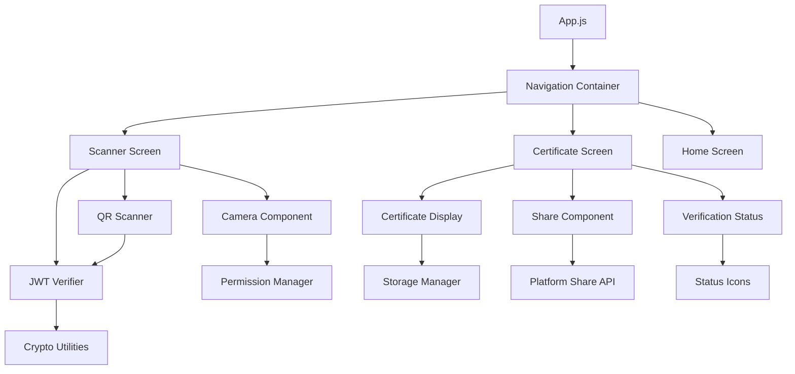
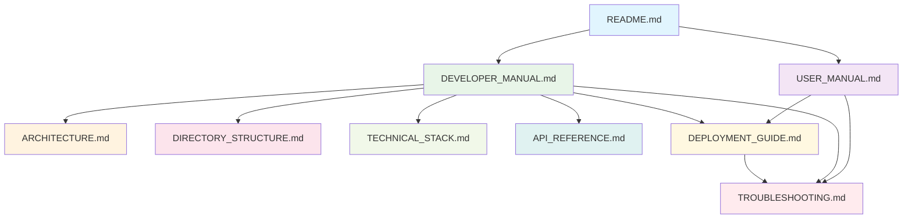

# 📁 Directory Structure - Certificate Verification System

**Version**: 1.0.0  
**Last Updated**: January 26, 2025  
**Team**: Oblivion - SIH 2025

---

## 📋 **Table of Contents**

1. [Project Overview](#-project-overview)
2. [Root Directory Structure](#-root-directory-structure)
3. [Python Scripts Directory](#-python-scripts-directory)
4. [React Native App Directory](#-react-native-app-directory)
5. [Documentation Directory](#-documentation-directory)
6. [Configuration Files](#-configuration-files)
7. [Build and Output Directories](#-build-and-output-directories)
8. [File Naming Conventions](#-file-naming-conventions)
9. [Directory Navigation Guide](#-directory-navigation-guide)

---

## 🎯 **Project Overview**

The Certificate Verification System follows a **modular, technology-specific directory structure** that separates concerns between the Python certificate generator, React Native mobile application, and comprehensive documentation.

### **High-Level Organization**
```
SIH25070/CP/
├── 📁 python-scripts/          # Certificate generation backend
├── 📁 react-native-app/        # Mobile verification application
├── 📁 Documentation/           # Comprehensive project documentation
├── 📄 README.md               # Project overview and quick start
├── 📄 USER_MANUAL.md          # End-user instructions
└── 📄 SYSTEM_OVERVIEW.md      # System architecture overview
```

---

## 🏗️ **Root Directory Structure**

```
SIH25070/CP/
│
├── 📁 python-scripts/                    # Python Certificate Generator
│   ├── 📄 certificate_generator.py       # Main GUI application
│   ├── 📄 hardware_info.py              # Hardware detection module
│   ├── 📄 generate_keys.py              # RSA key pair generation
│   ├── 📄 requirements.txt              # Python dependencies
│   └── 📁 output/                       # Generated certificates and keys
│       ├── 📄 private_key.pem           # RSA private key (2048-bit)
│       ├── 📄 public_key.pem            # RSA public key
│       └── 📄 certificates/             # Generated certificate files
│
├── 📁 react-native-app/                 # React Native Mobile App
│   ├── 📄 App.js                        # Main application component
│   ├── 📄 package.json                  # Node.js dependencies
│   ├── 📄 app.json                      # Expo configuration
│   ├── 📄 eas.json                      # EAS Build configuration
│   ├── 📄 metro.config.js               # Metro bundler config
│   ├── 📄 babel.config.js               # Babel transpiler config
│   ├── 📁 src/                          # Source code directory
│   │   ├── 📁 components/               # React Native components
│   │   ├── 📁 utils/                    # Utility functions
│   │   ├── 📁 demo-data/                # Sample data for development
│   │   └── 📁 assets/                   # Additional app assets
│   ├── 📁 assets/                       # App icons and graphics
│   ├── 📁 android/                      # Android-specific configurations
│   ├── 📁 ios/                          # iOS-specific configurations
│   └── 📁 node_modules/                 # Node.js dependencies (auto-generated)
│
├── 📁 Documentation/                     # Comprehensive Documentation
│   ├── 📄 README.md                     # Project overview and setup
│   ├── 📄 USER_MANUAL.md                # End-user operation guide
│   ├── 📄 DEVELOPER_MANUAL.md           # Technical implementation guide
│   ├── 📄 ARCHITECTURE.md               # System architecture documentation
│   ├── 📄 DIRECTORY_STRUCTURE.md        # This file - project organization
│   ├── 📄 TECHNICAL_STACK.md            # Technology stack details
│   ├── 📄 API_REFERENCE.md              # API documentation
│   ├── 📄 DEPLOYMENT_GUIDE.md           # Deployment instructions
│   └── 📄 TROUBLESHOOTING.md            # Common issues and solutions
│
├── 📄 README.md                         # Root project README
├── 📄 USER_MANUAL.md                    # Root user manual
├── 📄 SYSTEM_OVERVIEW.md                # System overview document
├── 📄 .gitignore                        # Git ignore patterns
└── 📄 LICENSE                           # Project license (if applicable)
```

---

## 🐍 **Python Scripts Directory**

### **Detailed Structure**
```
python-scripts/
│
├── 📄 certificate_generator.py          # Main Application Entry Point
│   │   ├── GUI Interface (tkinter)
│   │   ├── Certificate Generation Logic
│   │   ├── QR Code Display
│   │   └── File Save Operations
│
├── 📄 hardware_info.py                  # Hardware Detection Module
│   │   ├── Device Type Detection
│   │   ├── Motherboard Serial Extraction
│   │   ├── Disk Serial Extraction
│   │   └── System Information Gathering
│
├── 📄 generate_keys.py                  # Cryptographic Key Generation
│   │   ├── RSA Key Pair Generation (2048-bit)
│   │   ├── PEM Format Export
│   │   ├── Secure Key Storage
│   │   └── Key Validation
│
├── 📄 requirements.txt                  # Python Dependencies
│   │   ├── PyJWT==2.8.0                # JWT token handling
│   │   ├── qrcode[pil]==7.4.2          # QR code generation
│   │   ├── Pillow==10.0.1              # Image processing
│   │   ├── cryptography==41.0.7        # Cryptographic operations
│   │   └── Additional dependencies...
│
├── 📁 output/                           # Generated Files Directory
│   │   ├── 📄 private_key.pem           # RSA Private Key (Keep Secure!)
│   │   ├── 📄 public_key.pem            # RSA Public Key (Embeddable)
│   │   ├── 📁 certificates/             # Certificate Storage
│   │   │   ├── 📄 cert_YYYYMMDD_HHMMSS.jwt
│   │   │   └── 📄 cert_YYYYMMDD_HHMMSS.png
│   │   └── 📁 logs/                     # Application Logs
│   │       └── 📄 certificate_generator.log
│
├── 📁 tests/                            # Unit Tests (Optional)
│   │   ├── 📄 test_certificate_generator.py
│   │   ├── 📄 test_hardware_info.py
│   │   └── 📄 test_generate_keys.py
│
└── 📁 config/                           # Configuration Files (Optional)
    │   ├── 📄 settings.json             # Application settings
    │   └── 📄 logging.conf              # Logging configuration
```

### **File Purposes and Responsibilities**

| File | Purpose | Key Functions |
|------|---------|---------------|
| **certificate_generator.py** | Main application with GUI | `main()`, `create_certificate()`, `display_gui()` |
| **hardware_info.py** | Hardware detection and fingerprinting | `get_device_type()`, `get_device_id()`, `get_motherboard_serial()` |
| **generate_keys.py** | RSA key pair generation utility | `generate_rsa_keypair()`, `save_keys_to_files()` |
| **requirements.txt** | Python package dependencies | Package versions and constraints |

---

## 📱 **React Native App Directory**

### **Detailed Structure**
```
react-native-app/
│
├── 📄 App.js                            # Main Application Component
│   │   ├── Navigation Setup
│   │   ├── Screen Components Integration
│   │   ├── State Management
│   │   └── App-level Configuration
│
├── 📄 package.json                      # Node.js Project Configuration
│   │   ├── Dependencies and DevDependencies
│   │   ├── Scripts (start, build, test)
│   │   ├── Project Metadata
│   │   └── Expo SDK Version
│
├── 📄 app.json                          # Expo Application Configuration
│   │   ├── App Name and Slug
│   │   ├── Platform Configurations
│   │   ├── Icon and Splash Screen
│   │   └── Permissions and Features
│
├── 📄 eas.json                          # EAS Build Configuration
│   │   ├── Build Profiles (development, preview, production)
│   │   ├── Platform-specific Settings
│   │   ├── Environment Variables
│   │   └── Distribution Settings
│
├── 📄 metro.config.js                   # Metro Bundler Configuration
│   │   ├── Resolver Configuration
│   │   ├── Transformer Settings
│   │   └── Asset Handling
│
├── 📄 babel.config.js                   # Babel Transpiler Configuration
│   │   ├── Presets Configuration
│   │   ├── Plugin Settings
│   │   └── Environment-specific Options
│
├── 📁 src/                              # Source Code Directory
│   │
│   ├── 📁 components/                   # React Native Components
│   │   │
│   │   ├── 📄 ScannerScreen.js          # QR Code Scanner Interface
│   │   │   ├── Camera Integration (Expo Camera)
│   │   │   ├── QR Code Detection
│   │   │   ├── Permission Handling
│   │   │   ├── Scanning State Management
│   │   │   └── Navigation to Certificate Screen
│   │   │
│   │   ├── 📄 CertificateScreen.js      # Certificate Display Component
│   │   │   ├── Certificate Details Rendering
│   │   │   ├── Shield-based Design
│   │   │   ├── Verification Status Display
│   │   │   ├── Share Functionality
│   │   │   └── Navigation Controls
│   │   │
│   │   ├── 📄 HomeScreen.js             # Home/Landing Screen (Optional)
│   │   │   ├── Welcome Interface
│   │   │   ├── Quick Actions
│   │   │   └── Recent Certificates
│   │   │
│   │   └── 📁 common/                   # Reusable Components
│   │       ├── 📄 Button.js             # Custom button component
│   │       ├── 📄 LoadingSpinner.js     # Loading indicator
│   │       └── 📄 ErrorBoundary.js      # Error handling component
│   │
│   ├── 📁 utils/                        # Utility Functions
│   │   │
│   │   ├── 📄 jwtVerifier.js            # JWT Verification Logic
│   │   │   ├── Signature Verification (RS256)
│   │   │   ├── Public Key Validation
│   │   │   ├── Certificate Payload Extraction
│   │   │   ├── Error Handling
│   │   │   └── Verification Result Formatting
│   │   │
│   │   ├── 📄 storage.js                # Local Storage Management
│   │   │   ├── AsyncStorage Operations
│   │   │   ├── Certificate Caching
│   │   │   ├── Settings Persistence
│   │   │   └── Data Serialization
│   │   │
│   │   ├── 📄 permissions.js            # Permission Management
│   │   │   ├── Camera Permission Requests
│   │   │   ├── Permission Status Checking
│   │   │   └── Permission Error Handling
│   │   │
│   │   └── 📄 constants.js              # Application Constants
│   │       ├── API Endpoints (if any)
│   │       ├── Configuration Values
│   │       ├── Color Schemes
│   │       └── Default Settings
│   │
│   ├── 📁 demo-data/                    # Development Sample Data
│   │   │
│   │   ├── 📄 sampleCertificates.js     # Mock Certificate Data
│   │   │   ├── Valid Certificate Examples
│   │   │   ├── Invalid Certificate Examples
│   │   │   ├── Edge Case Scenarios
│   │   │   └── Testing Data Sets
│   │   │
│   │   └── 📄 mockResponses.js          # Mock API Responses
│   │       ├── Verification Responses
│   │       ├── Error Scenarios
│   │       └── Edge Cases
│   │
│   ├── 📁 assets/                       # Additional App Assets
│   │   ├── 📄 shield.png                # Certificate shield background
│   │   ├── 📄 icons/                    # Custom icons
│   │   └── 📄 fonts/                    # Custom fonts (if any)
│   │
│   ├── 📁 styles/                       # Styling and Themes
│   │   ├── 📄 globalStyles.js           # Global style definitions
│   │   ├── 📄 colors.js                 # Color palette
│   │   └── 📄 typography.js             # Font and text styles
│   │
│   └── 📁 hooks/                        # Custom React Hooks
│       ├── 📄 useCamera.js              # Camera management hook
│       ├── 📄 useStorage.js             # Storage management hook
│       └── 📄 usePermissions.js         # Permission management hook
│
├── 📁 assets/                           # Expo Assets Directory
│   │   ├── 📄 icon.png                  # App icon (1024x1024)
│   │   ├── 📄 splash.png                # Splash screen image
│   │   ├── 📄 adaptive-icon.png         # Android adaptive icon
│   │   └── 📄 favicon.png               # Web favicon
│
├── 📁 android/                          # Android Platform Configuration
│   │   ├── 📁 app/
│   │   │   ├── 📄 build.gradle          # Android build configuration
│   │   │   └── 📁 src/main/
│   │   │       ├── 📄 AndroidManifest.xml # Android permissions and config
│   │   │       └── 📁 res/              # Android resources
│   │   ├── 📄 build.gradle              # Project-level build config
│   │   ├── 📄 gradle.properties         # Gradle properties
│   │   └── 📄 settings.gradle           # Gradle settings
│
├── 📁 ios/                              # iOS Platform Configuration
│   │   ├── 📁 CertificateVerifier/      # iOS project directory
│   │   │   ├── 📄 Info.plist            # iOS app configuration
│   │   │   ├── 📄 AppDelegate.h         # iOS app delegate header
│   │   │   ├── 📄 AppDelegate.m         # iOS app delegate implementation
│   │   │   └── 📁 Images.xcassets/      # iOS image assets
│   │   ├── 📄 Podfile                   # CocoaPods dependencies
│   │   └── 📁 CertificateVerifier.xcodeproj/ # Xcode project files
│
├── 📁 __tests__/                        # Test Files Directory
│   │   ├── 📄 App.test.js               # App component tests
│   │   ├── 📄 ScannerScreen.test.js     # Scanner component tests
│   │   ├── 📄 jwtVerifier.test.js       # JWT verifier tests
│   │   └── 📄 __mocks__/                # Mock files for testing
│
├── 📁 node_modules/                     # Node.js Dependencies (Auto-generated)
│   │   └── [Thousands of dependency packages]
│
└── 📁 .expo/                            # Expo Configuration (Auto-generated)
    │   ├── 📄 settings.json             # Expo project settings
    │   └── 📁 web/                      # Web build artifacts
```

### **Component Hierarchy and Relationships**



---

## 📚 **Documentation Directory**

### **Comprehensive Documentation Structure**
```
Documentation/
│
├── 📄 README.md                         # Project Overview and Quick Start
│   │   ├── Project Description
│   │   ├── Quick Start Guide
│   │   ├── Installation Instructions
│   │   ├── Core Features Overview
│   │   ├── Technology Stack Summary
│   │   ├── Use Cases and Applications
│   │   ├── Team Information
│   │   └── Support and Contact Details
│
├── 📄 USER_MANUAL.md                    # End-User Operation Guide
│   │   ├── System Requirements
│   │   ├── Installation Guide
│   │   ├── Certificate Generator Usage
│   │   ├── Mobile App Usage
│   │   ├── Certificate Workflow
│   │   ├── Troubleshooting Guide
│   │   ├── Best Practices
│   │   ├── Security Guidelines
│   │   └── Frequently Asked Questions
│
├── 📄 DEVELOPER_MANUAL.md               # Technical Implementation Guide
│   │   ├── Development Environment Setup
│   │   ├── Architecture Overview
│   │   ├── Python Certificate Generator
│   │   ├── React Native Mobile App
│   │   ├── API Reference
│   │   ├── Database Schema
│   │   ├── Security Implementation
│   │   ├── Testing Framework
│   │   ├── Build and Deployment
│   │   └── Contributing Guidelines
│
├── 📄 ARCHITECTURE.md                   # System Architecture Documentation
│   │   ├── Architecture Overview
│   │   ├── System Components
│   │   ├── Data Flow Architecture
│   │   ├── Security Architecture
│   │   ├── Component Interactions
│   │   ├── Deployment Architecture
│   │   ├── Scalability Considerations
│   │   ├── Performance Architecture
│   │   ├── Reliability & Fault Tolerance
│   │   └── Future Architecture Roadmap
│
├── 📄 DIRECTORY_STRUCTURE.md            # Project Organization Guide (This File)
│   │   ├── Project Overview
│   │   ├── Root Directory Structure
│   │   ├── Python Scripts Directory
│   │   ├── React Native App Directory
│   │   ├── Documentation Directory
│   │   ├── Configuration Files
│   │   ├── Build and Output Directories
│   │   ├── File Naming Conventions
│   │   └── Directory Navigation Guide
│
├── 📄 TECHNICAL_STACK.md                # Technology Stack Details
│   │   ├── Technology Overview
│   │   ├── Backend Technologies (Python)
│   │   ├── Frontend Technologies (React Native)
│   │   ├── Cryptographic Libraries
│   │   ├── Development Tools
│   │   ├── Build and Deployment Tools
│   │   ├── Testing Frameworks
│   │   ├── Version Control and CI/CD
│   │   └── Technology Comparison and Rationale
│
├── 📄 API_REFERENCE.md                  # API Documentation
│   │   ├── Python API Reference
│   │   ├── React Native API Reference
│   │   ├── Certificate Format Specification
│   │   ├── JWT Payload Structure
│   │   ├── Error Codes and Messages
│   │   ├── Integration Examples
│   │   ├── SDK Documentation
│   │   └── Third-party Integrations
│
├── 📄 DEPLOYMENT_GUIDE.md               # Deployment Instructions
│   │   ├── Deployment Overview
│   │   ├── Python Application Deployment
│   │   ├── React Native App Deployment
│   │   ├── Build Configuration
│   │   ├── Distribution Strategies
│   │   ├── Environment Setup
│   │   ├── Security Considerations
│   │   ├── Monitoring and Maintenance
│   │   └── Rollback Procedures
│
└── 📄 TROUBLESHOOTING.md                # Common Issues and Solutions
    │   ├── Common Issues Overview
    │   ├── Python Application Issues
    │   ├── React Native App Issues
    │   ├── Build and Deployment Issues
    │   ├── Certificate Generation Problems
    │   ├── Verification Failures
    │   ├── Platform-specific Issues
    │   ├── Performance Optimization
    │   ├── Security Troubleshooting
    │   └── Getting Help and Support
```

### **Documentation Relationships**



---

## ⚙️ **Configuration Files**

### **Root Level Configuration**
```
SIH25070/CP/
├── 📄 .gitignore                        # Git Ignore Patterns
│   │   ├── Python-specific ignores (__pycache__, *.pyc)
│   │   ├── Node.js ignores (node_modules/, npm-debug.log)
│   │   ├── React Native ignores (.expo/, *.jks)
│   │   ├── IDE ignores (.vscode/, .idea/)
│   │   ├── OS ignores (.DS_Store, Thumbs.db)
│   │   └── Security ignores (*.pem, *.key, .env)
│
├── 📄 LICENSE                           # Project License
│   │   ├── License Type (MIT, Apache, etc.)
│   │   ├── Copyright Information
│   │   ├── Terms and Conditions
│   │   └── Liability and Warranty Disclaimers
│
└── 📄 .editorconfig                     # Editor Configuration (Optional)
    │   ├── Indentation Settings
    │   ├── Character Encoding
    │   ├── Line Ending Configuration
    │   └── File Type Specific Settings
```

### **Python Configuration Files**
```
python-scripts/
├── 📄 requirements.txt                  # Python Dependencies
├── 📄 setup.py                         # Package Setup (Optional)
├── 📄 pyproject.toml                   # Modern Python Project Config (Optional)
├── 📄 .pylintrc                        # Linting Configuration (Optional)
└── 📄 pytest.ini                       # Testing Configuration (Optional)
```

### **React Native Configuration Files**
```
react-native-app/
├── 📄 package.json                      # Node.js Project Configuration
├── 📄 package-lock.json                # Dependency Lock File
├── 📄 app.json                         # Expo Configuration
├── 📄 eas.json                         # EAS Build Configuration
├── 📄 metro.config.js                  # Metro Bundler Configuration
├── 📄 babel.config.js                  # Babel Transpiler Configuration
├── 📄 .eslintrc.js                     # ESLint Configuration (Optional)
├── 📄 .prettierrc                      # Prettier Configuration (Optional)
└── 📄 jest.config.js                   # Jest Testing Configuration (Optional)
```

---

## 🏗️ **Build and Output Directories**

### **Python Build Outputs**
```
python-scripts/
├── 📁 output/                           # Generated Files
│   ├── 📄 private_key.pem               # RSA Private Key (2048-bit)
│   ├── 📄 public_key.pem                # RSA Public Key
│   ├── 📁 certificates/                 # Generated Certificates
│   │   ├── 📄 cert_20250126_143022.jwt  # JWT Certificate
│   │   ├── 📄 cert_20250126_143022.png  # QR Code Image
│   │   └── 📄 cert_20250126_143022.json # Certificate Metadata
│   └── 📁 logs/                         # Application Logs
│       ├── 📄 certificate_generator.log # Main application log
│       ├── 📄 hardware_detection.log    # Hardware detection log
│       └── 📄 error.log                 # Error log
│
├── 📁 dist/                             # Distribution Files (PyInstaller)
│   ├── 📄 certificate_generator.exe     # Windows Executable
│   ├── 📄 certificate_generator.app     # macOS Application Bundle
│   └── 📄 certificate_generator         # Linux Executable
│
└── 📁 build/                            # Build Artifacts (PyInstaller)
    └── [Temporary build files]
```

### **React Native Build Outputs**
```
react-native-app/
├── 📁 .expo/                            # Expo Build Cache
│   ├── 📄 settings.json                 # Expo project settings
│   ├── 📁 web/                          # Web build artifacts
│   └── 📁 packager-info.json           # Metro packager info
│
├── 📁 android/app/build/                # Android Build Outputs
│   ├── 📁 outputs/apk/                  # APK Files
│   │   ├── 📄 app-debug.apk             # Debug APK
│   │   └── 📄 app-release.apk           # Release APK
│   └── 📁 intermediates/                # Intermediate build files
│
├── 📁 ios/build/                        # iOS Build Outputs
│   ├── 📁 Build/Products/               # iOS Build Products
│   │   ├── 📄 CertificateVerifier.app   # iOS App Bundle
│   │   └── 📄 CertificateVerifier.ipa   # iOS Installation Package
│   └── 📁 Logs/                         # Build logs
│
└── 📁 web-build/                        # Web Build (Expo Web)
    ├── 📄 index.html                    # Web entry point
    ├── 📁 static/                       # Static assets
    └── 📄 manifest.json                 # Web app manifest
```

---

## 📝 **File Naming Conventions**

### **General Naming Rules**

| File Type | Convention | Example |
|-----------|------------|---------|
| **Python Files** | snake_case | `certificate_generator.py` |
| **JavaScript Files** | camelCase | `jwtVerifier.js` |
| **React Components** | PascalCase | `ScannerScreen.js` |
| **Configuration Files** | lowercase with dots | `babel.config.js` |
| **Documentation Files** | UPPERCASE | `README.md` |
| **Asset Files** | lowercase with hyphens | `app-icon.png` |
| **Test Files** | Original name + .test | `jwtVerifier.test.js` |

### **Certificate File Naming**
```
Format: cert_YYYYMMDD_HHMMSS.{extension}
Examples:
├── 📄 cert_20250126_143022.jwt          # JWT Certificate
├── 📄 cert_20250126_143022.png          # QR Code Image
├── 📄 cert_20250126_143022.json         # Certificate Metadata
└── 📄 cert_20250126_143022.log          # Generation Log
```

### **Build Artifact Naming**
```
Format: {app-name}-{version}-{platform}.{extension}
Examples:
├── 📄 certificate-verifier-1.0.0-android.apk
├── 📄 certificate-verifier-1.0.0-ios.ipa
├── 📄 certificate-generator-1.0.0-windows.exe
└── 📄 certificate-generator-1.0.0-macos.app
```

---

## 🧭 **Directory Navigation Guide**

### **Quick Navigation Commands**

#### **For Developers**
```bash
# Navigate to project root
cd E:\SIH2025\SIH25070\CP

# Python development
cd python-scripts
python certificate_generator.py

# React Native development
cd react-native-app
npm start

# Documentation
cd Documentation
# Open any .md file in your preferred editor
```

#### **For Users**
```bash
# Run certificate generator
cd python-scripts
python certificate_generator.py

# Install mobile app
cd react-native-app
# Follow installation instructions in USER_MANUAL.md
```

### **Important Directories for Different Roles**

| Role | Primary Directories | Purpose |
|------|-------------------|---------|
| **End Users** | `python-scripts/`, `Documentation/USER_MANUAL.md` | Certificate generation and usage |
| **Developers** | `python-scripts/`, `react-native-app/src/`, `Documentation/DEVELOPER_MANUAL.md` | Code development and modification |
| **DevOps** | `react-native-app/eas.json`, `Documentation/DEPLOYMENT_GUIDE.md` | Build and deployment |
| **Security Auditors** | `python-scripts/generate_keys.py`, `react-native-app/src/utils/jwtVerifier.js` | Security review |
| **Testers** | `__tests__/`, `python-scripts/tests/`, `Documentation/TROUBLESHOOTING.md` | Testing and QA |
| **Documentation Writers** | `Documentation/` | Documentation maintenance |

### **File Search Patterns**

#### **Find Specific File Types**
```bash
# Find all Python files
find . -name "*.py"

# Find all JavaScript/React files
find . -name "*.js" -o -name "*.jsx"

# Find all configuration files
find . -name "*.json" -o -name "*.config.js"

# Find all documentation files
find . -name "*.md"
```

#### **Search for Specific Content**
```bash
# Find JWT-related code
grep -r "JWT" --include="*.py" --include="*.js" .

# Find certificate generation code
grep -r "certificate" --include="*.py" .

# Find QR code related code
grep -r "qr" --include="*.js" .
```

### **Directory Size and Statistics**

| Directory | Estimated Size | File Count | Purpose |
|-----------|---------------|------------|---------|
| **python-scripts/** | ~50 MB | ~20 files | Certificate generation |
| **react-native-app/** | ~200 MB | ~500+ files | Mobile application |
| **Documentation/** | ~5 MB | ~10 files | Project documentation |
| **node_modules/** | ~150 MB | ~10,000+ files | Dependencies |
| **Total Project** | ~400 MB | ~10,500+ files | Complete system |

---

## 🔍 **Directory Best Practices**

### **Organization Principles**

1. **Separation of Concerns**: Each directory has a single, clear purpose
2. **Technology Grouping**: Related technologies are grouped together
3. **Logical Hierarchy**: Nested directories follow logical relationships
4. **Consistent Naming**: Uniform naming conventions across the project
5. **Documentation Co-location**: Documentation near relevant code

### **Maintenance Guidelines**

1. **Regular Cleanup**: Remove unused files and directories
2. **Dependency Management**: Keep dependencies up to date
3. **Log Rotation**: Implement log file rotation for long-running applications
4. **Backup Strategy**: Regular backups of critical directories
5. **Access Control**: Proper permissions on sensitive directories

### **Security Considerations**

| Directory | Security Level | Access Control |
|-----------|---------------|----------------|
| **python-scripts/output/** | High | Restricted access to private keys |
| **react-native-app/src/utils/** | Medium | Code review required |
| **Documentation/** | Low | Public access allowed |
| **.git/** | High | Version control security |
| **node_modules/** | Low | Auto-generated, can be rebuilt |

---

**🎯 This directory structure provides a clear, organized, and maintainable foundation for the Certificate Verification System, enabling efficient development, deployment, and maintenance.**

---

**Document Version**: 1.0.0  
**Last Updated**: January 26, 2025  
**Next Review**: April 26, 2025  
**Maintained By**: Oblivion Team - SIH 2025