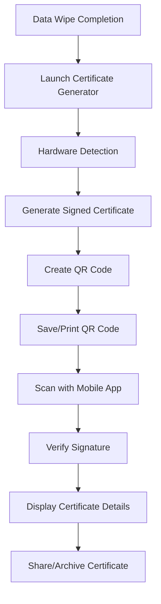

# 📖 User Manual - Certificate Verification System

<!-- **Version**: 1.0.0  
**Last Updated**: January 26, 2025  
**Team**: Oblivion - SIH 2025 -->

---

## 📋 **Table of Contents**

1. [Introduction](#-introduction)
2. [System Requirements](#-system-requirements)
3. [Installation Guide](#-installation-guide)
4. [Certificate Generator (Python)](#-certificate-generator-python)
5. [Mobile Verifier App](#-mobile-verifier-app)
6. [Certificate Workflow](#-certificate-workflow)
7. [Troubleshooting](#-troubleshooting)
8. [Best Practices](#-best-practices)
9. [Security Guidelines](#-security-guidelines)
10. [FAQ](#-frequently-asked-questions)

---

## 🎯 **Introduction**

The **Certificate Verification System** is a comprehensive solution for generating and verifying secure data wipe certificates. This system operates **100% offline** and provides cryptographically signed certificates that prove successful data sanitization according to industry standards.

### **What This System Does**
- ✅ **Generates** secure certificates after data wipe completion
- ✅ **Creates** QR codes containing cryptographically signed certificates
- ✅ **Verifies** certificate authenticity using mobile app
- ✅ **Operates** completely offline for maximum security
- ✅ **Complies** with NIST SP 800-88 and DoD 5220.22-M standards

### **Who Should Use This System**
- **IT Administrators** managing device disposal
- **Security Teams** requiring compliance documentation
- **Government Agencies** handling classified data destruction
- **Healthcare Organizations** ensuring HIPAA compliance
- **Financial Institutions** meeting PCI DSS requirements

---

## 💻 **System Requirements**

### **Certificate Generator (Python)**

| Component | Minimum | Recommended |
|-----------|---------|-------------|
| **Operating System** | Windows 10, macOS 10.14, Ubuntu 18.04 | Windows 11, macOS 12+, Ubuntu 20.04+ |
| **Python Version** | Python 3.7 | Python 3.9+ |
| **RAM** | 1 GB | 4 GB |
| **Storage** | 100 MB | 500 MB |
| **Display** | 1024x768 | 1920x1080 |

### **Mobile Verifier App**

| Platform | Minimum | Recommended |
|----------|---------|-------------|
| **Android** | Android 6.0 (API 23) | Android 10+ |
| **iOS** | iOS 11.0 | iOS 14+ |
| **RAM** | 1 GB | 4 GB |
| **Storage** | 50 MB | 100 MB |
| **Camera** | Rear camera with autofocus | High-resolution camera |

---

## 🔧 **Installation Guide**

### **Step 1: Certificate Generator Setup**

#### **Windows Installation**
```powershell
# 1. Download and install Python 3.9+ from python.org
# 2. Open Command Prompt as Administrator
# 3. Navigate to project directory
cd E:\SIH2025\SIH25070\CP\python-scripts

# 4. Install required packages
pip install -r requirements.txt

# 5. Generate RSA key pairs (one-time setup)
python generate_keys.py

# 6. Verify installation
python certificate_generator.py
```

#### **macOS Installation**
```bash
# 1. Install Python using Homebrew
brew install python@3.9

# 2. Navigate to project directory
cd /path/to/CP/python-scripts

# 3. Install required packages
pip3 install -r requirements.txt

# 4. Generate RSA key pairs
python3 generate_keys.py

# 5. Launch certificate generator
python3 certificate_generator.py
```

#### **Linux Installation**
```bash
# 1. Install Python and pip
sudo apt update
sudo apt install python3 python3-pip python3-tk

# 2. Navigate to project directory
cd /path/to/CP/python-scripts

# 3. Install required packages
pip3 install -r requirements.txt

# 4. Generate RSA key pairs
python3 generate_keys.py

# 5. Launch certificate generator
python3 certificate_generator.py
```

### **Step 2: Mobile App Setup**

#### **Option A: Using Expo Go (Recommended for Testing)**
1. **Install Expo Go** from App Store (iOS) or Google Play (Android)
2. **Navigate to app directory**:
   ```bash
   cd react-native-app
   npm install
   npx expo start
   ```
3. **Scan QR code** displayed in terminal with Expo Go app

#### **Option B: Building APK/IPA (Production)**
1. **Install EAS CLI**:
   ```bash
   npm install -g @expo/eas-cli
   ```
2. **Build Android APK**:
   ```bash
   eas build -p android --profile preview
   ```
3. **Build iOS IPA**:
   ```bash
   eas build -p ios --profile preview
   ```

---

## 🖥️ **Certificate Generator (Python)**

### **First-Time Setup**

#### **1. Generate Key Pairs**
```bash
python generate_keys.py
```
**What this does**:
- Creates `private_key.pem` (keep secure!)
- Creates `public_key.pem` (embedded in mobile app)
- Displays key generation confirmation

#### **2. Test Installation**
```bash
python generate_test_jwt.py
```
**Expected output**:
- Creates `test_jwt_token.txt`
- Displays "Test JWT generated successfully"

### **Using the Certificate Generator**

#### **Step 1: Launch Application**
```bash
python certificate_generator.py
```

#### **Step 2: Certificate Generation Interface**


**Interface Elements**:
- **Device Information**: Automatically detected hardware details
- **Wipe Method**: Pre-configured DoD 5220.22-M 3-pass
- **Generate Certificate**: Creates signed certificate and QR code
- **Save QR Code**: Exports QR code as PNG image

#### **Step 3: Generate Certificate**

1. **Click "Generate Certificate"**
   - System detects hardware automatically
   - Creates unique certificate ID
   - Generates cryptographic signature
   - Displays QR code in popup window

2. **Review Certificate Details**
   ```
   Certificate ID: 12345678-1234-5678-9012-123456789012
   Device Type: Desktop
   Device ID: MB123456_HDD789012
   Wipe Method: DoD 5220.22-M 3-pass
   Timestamp: 2025-01-26T10:30:00Z
   Status: SUCCESS
   ```

3. **Save QR Code**
   - Click "Save QR Code" button
   - Choose save location
   - File saved as `certificate_qr_YYYYMMDD_HHMMSS.png`

#### **Step 4: Certificate Verification**
- QR code contains complete certificate information
- Cryptographically signed with RS256 algorithm
- Can be verified offline using mobile app

### **Hardware Detection Details**

The system automatically detects:
- **Device Type**: Desktop, Laptop, Server, Workstation
- **Motherboard Serial**: Unique hardware identifier
- **Primary Disk Serial**: Storage device identifier
- **Operating System**: Windows, macOS, Linux details

---

## 📱 **Mobile Verifier App**

### **App Interface Overview**

#### **Scanner Screen**
- **Camera View**: Live camera feed for QR scanning
- **Scan Area**: Highlighted region for QR code placement
- **Instructions**: "Point camera at QR code to scan"
- **Auto-Focus**: Automatic camera focusing for optimal scanning

#### **Certificate Display Screen**
- **Shield Background**: Professional certificate presentation
- **Certificate Details**: Complete certificate information
- **Verification Status**: Green checkmark for valid certificates
- **Share Button**: Export certificate details
- **Back Button**: Return to scanner

### **Using the Mobile App**

#### **Step 1: Launch App**
1. Open **Certificate Verifier** app
2. Grant camera permissions when prompted
3. Scanner screen appears automatically

#### **Step 2: Scan QR Code**
1. **Position QR code** within camera viewfinder
2. **Hold steady** until automatic recognition
3. **Wait for processing** (typically < 1 second)
4. **View results** on certificate display screen

#### **Step 3: Verify Certificate**

**Valid Certificate Display**:
```
✅ CERTIFICATE VERIFIED

Certificate ID: 12345678-1234-5678-9012-123456789012
Device Type: Desktop
Device ID: MB123456_HDD789012
Wipe Method: DoD 5220.22-M 3-pass
Completion Time: Jan 26, 2025 10:30 AM IST
Status: SUCCESS
Data Hash: sha256:abc123...
Issuer: Certificate Generator v1.0
```

**Invalid Certificate Display**:
```
❌ CERTIFICATE INVALID

Error: Invalid signature
Reason: Certificate has been tampered with
Action: Contact system administrator
```

#### **Step 4: Share Certificate**
1. **Tap Share button** on certificate screen
2. **Choose sharing method**:
   - Email certificate details
   - Save to device storage
   - Share via messaging apps
   - Export as text file

---

## 🔄 **Certificate Workflow**

### **Complete Process Overview**



### **Detailed Workflow Steps**

#### **Phase 1: Certificate Generation**
1. **Complete data wipe** using approved methods
2. **Launch Python certificate generator**
3. **Verify hardware detection** is accurate
4. **Generate certificate** with cryptographic signature
5. **Save QR code** to secure location
6. **Print certificate** if required for physical records

#### **Phase 2: Certificate Verification**
1. **Launch mobile verifier app**
2. **Scan QR code** using device camera
3. **Verify cryptographic signature** offline
4. **Review certificate details** for accuracy
5. **Share or archive** certificate as needed
6. **Document verification** in compliance records

#### **Phase 3: Record Keeping**
1. **Archive QR code images** in secure storage
2. **Maintain certificate database** with timestamps
3. **Generate compliance reports** as required
4. **Backup certificate records** regularly
5. **Audit certificate validity** periodically

---

## 🔧 **Troubleshooting**

### **Certificate Generator Issues**

#### **Problem**: "Module not found" error
**Solution**:
```bash
pip install -r requirements.txt
# or
pip3 install -r requirements.txt
```

#### **Problem**: GUI window doesn't appear
**Solution**:
- **Windows**: Install tkinter: `pip install tk`
- **Linux**: Install tkinter: `sudo apt install python3-tk`
- **macOS**: Reinstall Python with tkinter support

#### **Problem**: Hardware detection fails
**Solution**:
1. Run as administrator/root
2. Check system permissions
3. Verify WMI service (Windows)
4. Update system drivers

#### **Problem**: QR code generation fails
**Solution**:
```bash
pip install --upgrade qrcode[pil] Pillow
```

### **Mobile App Issues**

#### **Problem**: Camera permission denied
**Solution**:
1. Go to device Settings
2. Find Certificate Verifier app
3. Enable Camera permission
4. Restart app

#### **Problem**: QR code won't scan
**Solution**:
- Ensure good lighting conditions
- Clean camera lens
- Hold device steady
- Try different angles
- Check QR code quality

#### **Problem**: "Invalid signature" error
**Solution**:
- Verify QR code is not damaged
- Check if certificate has expired
- Ensure public key matches private key
- Regenerate certificate if necessary

#### **Problem**: App crashes on startup
**Solution**:
1. Clear app cache and data
2. Reinstall app
3. Check device compatibility
4. Update Expo Go app

### **Common Error Messages**

| Error Message | Cause | Solution |
|---------------|-------|----------|
| `ModuleNotFoundError: No module named 'jwt'` | Missing PyJWT library | `pip install PyJWT` |
| `Permission denied: camera` | Camera access denied | Enable camera permissions |
| `Invalid JWT signature` | Certificate tampered/corrupted | Regenerate certificate |
| `Hardware detection failed` | Insufficient permissions | Run as administrator |
| `QR code unreadable` | Poor image quality | Improve lighting/focus |

---

## ✅ **Best Practices**

### **Certificate Generation**
- ✅ **Generate keys once** and store securely
- ✅ **Run generator immediately** after data wipe
- ✅ **Verify hardware detection** before generating
- ✅ **Save QR codes** with descriptive filenames
- ✅ **Test certificates** before archiving
- ✅ **Backup certificate records** regularly

### **Certificate Verification**
- ✅ **Scan in good lighting** conditions
- ✅ **Hold device steady** during scanning
- ✅ **Verify all details** match expectations
- ✅ **Share certificates** through secure channels
- ✅ **Archive verification records** properly
- ✅ **Regular app updates** for security

### **Security Practices**
- ✅ **Protect private keys** with encryption
- ✅ **Use air-gapped systems** when possible
- ✅ **Regular key rotation** for production
- ✅ **Audit certificate validity** periodically
- ✅ **Secure certificate storage** with backups
- ✅ **Document all procedures** for compliance

### **Compliance Management**
- ✅ **Maintain certificate database** with metadata
- ✅ **Generate regular reports** for auditors
- ✅ **Document verification procedures** clearly
- ✅ **Train staff** on proper usage
- ✅ **Regular system testing** and validation
- ✅ **Keep audit trails** of all activities

---

## 🔒 **Security Guidelines**

### **Key Management**
- **Private Key Security**: Store in encrypted containers
- **Key Backup**: Multiple secure locations
- **Access Control**: Limit key access to authorized personnel
- **Key Rotation**: Regular key updates for production systems
- **Key Recovery**: Documented recovery procedures

### **Certificate Handling**
- **Secure Generation**: Use trusted, isolated systems
- **Tamper Protection**: Verify certificate integrity regularly
- **Secure Storage**: Encrypted archives with access logs
- **Transmission Security**: Use secure channels for sharing
- **Retention Policy**: Define certificate lifecycle management

### **Mobile App Security**
- **App Updates**: Keep app updated with latest security patches
- **Device Security**: Use devices with screen locks and encryption
- **Network Isolation**: Verify offline operation capability
- **Data Protection**: Secure storage of verification history
- **Access Control**: Restrict app access to authorized users

---

## ❓ **Frequently Asked Questions**

### **General Questions**

**Q: Does this system require internet connectivity?**
A: No, the system operates 100% offline for maximum security.

**Q: Can certificates be forged or tampered with?**
A: No, certificates use RS256 cryptographic signatures that detect any tampering.

**Q: How long are certificates valid?**
A: Certificates don't expire but include timestamps for audit purposes.

**Q: Can I use this system for compliance reporting?**
A: Yes, certificates meet NIST SP 800-88 and DoD 5220.22-M standards.

### **Technical Questions**

**Q: What happens if I lose the private key?**
A: You'll need to regenerate key pairs and create new certificates. Previous certificates remain valid.

**Q: Can I customize the certificate format?**
A: Yes, modify the certificate_generator.py file to add custom fields.

**Q: How secure is the RS256 algorithm?**
A: RS256 with 2048-bit keys is considered cryptographically secure for decades.

**Q: Can I integrate this with existing systems?**
A: Yes, the system provides APIs and can be integrated with enterprise workflows.

### **Troubleshooting Questions**

**Q: Why won't the QR code scan?**
A: Check lighting, camera focus, QR code quality, and app permissions.

**Q: The certificate generator won't start. What should I do?**
A: Verify Python installation, install dependencies, and check system permissions.

**Q: How do I verify the system is working correctly?**
A: Run the test scripts and verify end-to-end certificate generation and verification.

---

## 📞 **Support and Resources**

### **Documentation**
- **[Developer Manual](DEVELOPER_MANUAL.md)** - Technical implementation details
- **[Architecture Guide](ARCHITECTURE.md)** - System design and components
- **[API Reference](API_REFERENCE.md)** - Complete API documentation
- **[Troubleshooting Guide](TROUBLESHOOTING.md)** - Detailed problem resolution

### **Contact Information**
- **Technical Support**: support@certificate-system.com
- **Documentation**: docs@certificate-system.com
- **Security Issues**: security@certificate-system.com

### **Additional Resources**
- **GitHub Repository**: [Certificate System](https://github.com/your-repo)
- **Issue Tracking**: [GitHub Issues](https://github.com/your-repo/issues)
- **Community Forum**: [Discussions](https://github.com/your-repo/discussions)

---

**🎉 You're now ready to use the Certificate Verification System!**

*This user manual provides comprehensive guidance for operating both the certificate generator and mobile verifier app. For technical details and development information, refer to the Developer Manual.*

---

**Document Version**: 1.0.0  
**Last Updated**: January 26, 2025  
**Next Review**: March 26, 2025